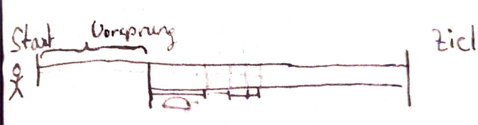

## 1.1.1 Thales von Milet (1. Philosoph)

Stellt sich 2 Fragen:  

1: Woher kommt alles?  

2: Woraus besteht alles?  

Die Antwort auf beide Fragen ist seiner Meinung nach Wasser! Er merkte, dass Wasser alle drei Aggregatzustände annehmen kann. Er erklärt sich den Beginn der Welt so, dass es am Anfang der Welt nur flüssiges Wasser gab, was sich verdickte oder verdünnte und so zu allem wurde, was man heute kennt. Er war auch der erste zu seiner Zeit, der Naturkatastrophen physikalisch erklären konnte bzw. wollte. Er ließ dabei Götter komplett aus dem Spiel. Seine Vorstellung der Welt sah so aus:  

Erdbeben erklärte er damit, dass das Wasser, auf dem das dichte Wasser schwimmt, also Land, schwingt und so das Land wackelt.  

Thales geht auch mal in der Nacht spazieren, fällt in eine Grube und wird von der thrakischen Magd ausgelacht. Er findet, dass diese Situation eine gute Metapher für die Beziehung der Gesellschaft zu Philosophen ist.  

## 1.1.2 Parmenides von Elea-500 v. Chr.

Formuliert klar, dass Konstanz nicht bedeutet, dass die Form oder das Aussehen eines Objekts gleichbleibt. Es sind zwar Veränderungen möglich, aber das Endergebnis muss immer dasselbe sein. Er hat so den Energieerhaltungssatz formuliert, der bis heute gilt. Er besagt unter anderem, dass es unmöglich ist, dass etwas aus dem Nichts entsteht oder, dass etwas zerstört wird. Alle reellen Teilchen halten sich daran, nur im Quantenvakuum wird dieses Gesetz gebrochen, was ihn allerdings nicht widerlegt.  

## 1.1.3 Zenon von Elea

Stellt das Paradoxon der Schildkröte und Achill auf. (Paradoxon=Richtige Annahmen, die zu einem falschen Schluss führen)  

Er kommt zu dem Schluss, dass Achill die Schildkröte niemals einholen wird, da, egal wie lang Achill läuft, die Schildkröte sich immer einen gewissen Vorsprung herausholt. Nicht zu Hause ausprobieren! Es funktioniert nur im Kopf.  

## 1.1.4 Demokrit von Abdera-500 v. Chr.

Er leitet aus der Frage „Woraus besteht alles?“ die Frage „Wie oft kann man alles teilen?“ ab. Er kam auf zwei Möglichkeiten:  

1. Bis zu einem unteilbaren Teilchen, dass er Atom nannte (gr. Unteilbar)  

2. Unendlich oft, was sich heute als falsch herausstellt. Die kleinste theoretische Einheit sind Strings.  

Seit dem 20. Jh. Ist es bekannt, dass das Atom nochmal teilbar ist, wir haben dem Wort Atom nur die Bedeutung aberkannt, dass es unteilbar ist, aber keinen anderen Namen gegeben.  

