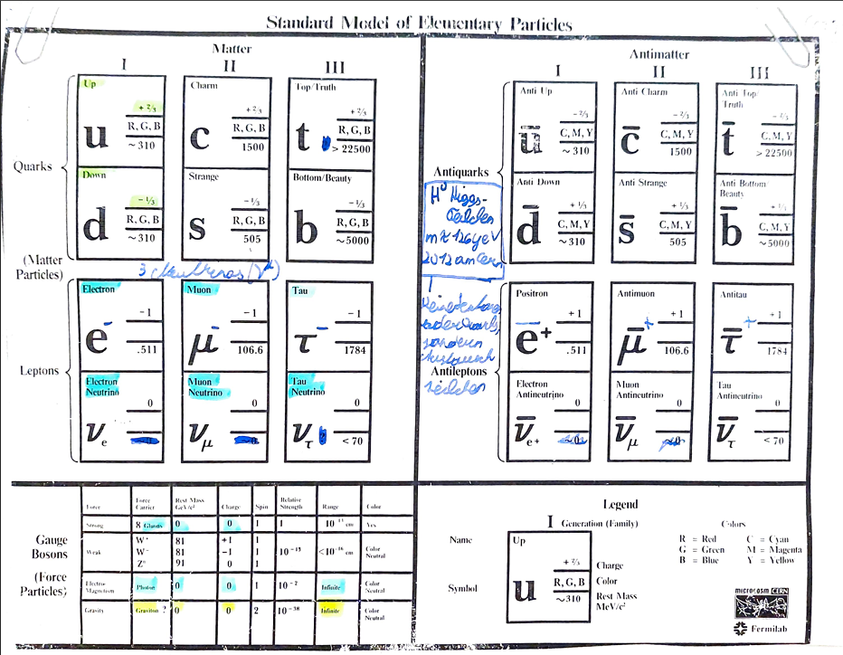
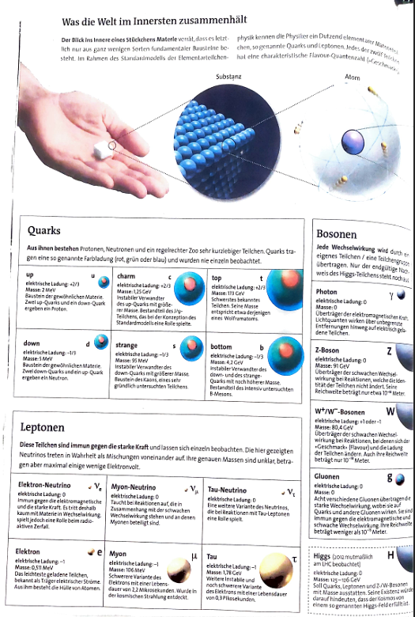
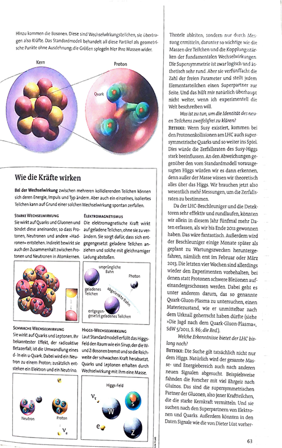

## Inhalt

- [2.1 Das Standartmodell der Elementarteilchen der Physik](./01_dasStandartmodellDerElementarteilchenDerPhysik.md)
- [2.2 Die vier Grundwechselwirkungen](./02_dieVierGrundwechselwirkungen.md)
- [2.3 Experimentelle Teilchenforschung am CERN](./03_experimentelleTeilchenforschungAmCern.md)

