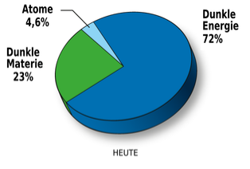
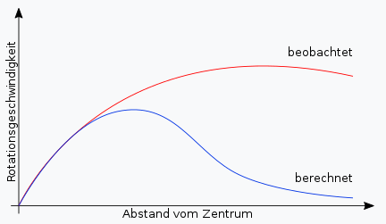

Das Herzstück des CERN ist ein Synchrotron, also ein runder Teilchenbeschleuniger, der LHC (Large Hadron Collider) genannt wird. Neben dieser Art von Beschleunigern gibt es auch noch Linearbeschleuniger, die nicht in sich geschlossen sind. Insgesamt gibt es im CERN vier Teilchendetektoren.  

## 2.3.1 Forschungsziele am LHC

**Die Entdeckung von dunkler Materie** ist essentiell für unser Verständnis des Universums. Wir wissen nicht was sie ist bzw. woraus diese besteht. Sie ist (bisher) ein theoretisches Konstrukt, dass hilft zu erklären, warum Sterne vor allem am Rand von Galaxien schneller rotieren als berechnet. Sie muss also mit der Gravitation wechselwirken. Eine weitere Beobachtung, die auf die Existenz von dunkler Materie hinweist, ist, dass manche Galaxiehaufen nicht die nötige Masse besitzen, um ihre Materie zusammenzuhalten. Sie bräuchten teilweise ihre 400-fache Masse. Diese paradoxen Beobachtungen soll die dunkle Materie lösen. Neben der dunklen Materie gibt es warscheinlich auch die sogenannte dunkle Energie. Das ist ein Hilfsmittel, um die immer schnellere Expansion des Universums zu erklären. Insgesamt macht Sichtbare Materie dabei nur einen extrem geringen Anteil der Gesamtenergie des Universums aus.  

**Die Higgs-Theorie und das Higgs-Teilchen** zu beweisen, ist ein weiteres Forschungsziel. Das ist eine Theorie, die den Anspruch hat, zu erklären, was Masse ist. Laut ihr bilden Higgs-teilchen das sogenannte Higgs-Feld. Teilchen, die Masse besitzen wechselwirken damit, welche mit hoher Masse stärker als jene mit kleiner Masse. Masselose Teilchen wie das Photon wechselwirken gar nicht mit dem Feld.  

**Das Quark Gluonen Plasma** ist ein Aggregatzustand, in dem Quarks frei sind und nicht mehr größere Teilchen wie Protonen bilden. Auf der Erde ist es sehr schwer Materie in diese Form zu zwingen, da dafür Unmengen an Energie notwendig sind. Warum machen wir es? Weil wir die Eigenschaften von Quarks sonst nicht erforschen können, da sie sonst immer aneinander gebunden sind. Es gibt Hinweise auf Quarksterne: Das sind Objekte, die extrem Dicht sind. Aufgrund dessen können wegen ihrer Wellenlänge keine Kernbausteine mehr existieren und sie spalten sich in Quarks auf. Bisher wurde kein solcher Stern gefunden, da sie ihre Masse eine sehr geringe Schwankungsbreite hat. Wären sie etwas leichter, handelt es sich um einen Neutronenstern, sind sie etwas zu schwer, ist es ein schwarzes Loch. Der Quarkstern kollabiert aufgrund des Pauli-Prinzips (Quantendruck) nicht zu einem solchen.  

**Die Supersymmetrie** sagt im Grunde, dass sich jedes Boson in ein bestimmtes, ihm zugewiesenes SUSY-Teilchen umwandeln kann und umgekehrt. Das SUSY-Teilchen eines Bosons wäre ein Fermion und das eines Fermions ein Boson. Bosonen und Fermionen unterscheiden sich durch ihren Spin: Der eines Fermions ist halbzahlig, der eines Bosons ganzzahlig. Fermionen sind der Baustein der Materie, aus der wir bestehen, Bosonen sind unter anderem Träger von Kräften, also Austauschteilchen. Ein weiterer Aspekt der Supersymmetrie sind WIMPs (Weakly interacting massive particle). Diese sollen nur mit der schwachen und der Gravitationskraft wechselwirken und eine enorme Masse haben. Das leichteste dieser Teilchen nennt man Neutralino. Es ist dem Neutrino sehr ähnlich, hat aber eine deutlich größere Masse. Diese könnten unter anderem auch die dunkle Materie bilden. Allgemein geht man heute nicht mehr davon aus, dass die Supersymmetrie auf jeden Fall existiert, da bis heute kein WIMP bzw. SUSY-Teilchen entdeckt wurde. Eine ad-hoc Erklärung wären Super WIMPs, die nur mit der Gravitation wechselwirken.  

**Mini-Black Holes** sollen die String-Theorie belegen. Sie sind (laut Theorie) kleiner als Protonen und haben eine sehr kurze Lebensdauer von etwa 10-26 Sekunden. Deshalb sind sie auch komplett harmlos. Sie leben nicht lange genug, um irgendwas einzusaugen. Im Gegensatz zu astrophysikalischen schwarzen Löchern , die bei Supernovae entstehen, haben sie nämlich eine extrem geringe Masse.  

**Die Materie-Antimaterie Asymmetrie **stellt die moderne Physik vor Rätsel. Zu jedem Teilchen gibt es auch ein Antiteilchen. Sie unterscheiden sich unter anderem durch ihre elektromagnetische Ladung. Wenn sich zum Beispiel ein Elektron und Positron begegnen, dann annihilieren sie und löschen sich so aus. Als das Universum entstanden ist, muss es also von Beginn an mehr Materie als Antimaterie gegeben haben, da sonst nur Energie in Form von elektromagnetischer Strahlung existieren würde. Das heute errechnete, ursprüngliche Verhältnis ist $\frac{1000000001 Teilchen}{1000000000 Antiteilchen}$. Damit ist kaum mehr Materie übrig, allerdings genug, um all das zu Formen, was wir sehen.  

