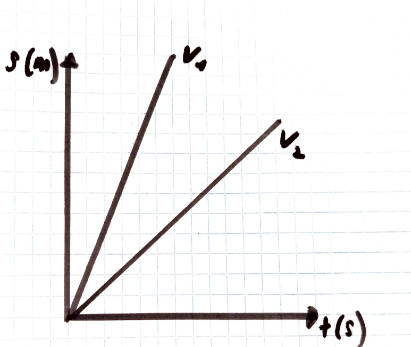
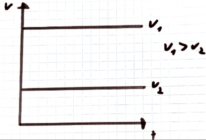
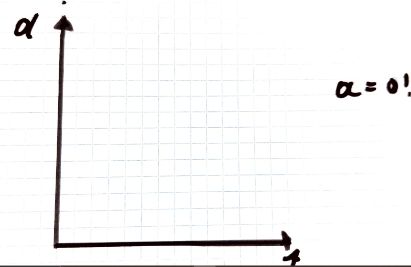

## 4.3.1 Die Geschwindigkeit

**Symbol**: v  

Einheit m/s  

Die Geschwindigkeit ist ein Vektor, d.h. sie hat immer einen Betrag und eine Richtung. Der Betrag entspricht dem Zahlenwert.  

Je kleiner Δs wird, desto genauer kann man die Geschwindigkeit bestimmen. So kommt man auf die Formel der Momentgeschwindigkeit: $v=\frac{ds}{dt}$  

## 4.3.2 Die Beschleunigung

**Symbol**: $a, a$  

**Einheit**: $m/s^{2}$  

Die Beschleunigung ist ein Vektor.  

**Definition**: Beschleunigung bedeutet Geschwindigkeitsänderung.  

Da die Geschwindigkeit ein Vektor ist, kann sich der Betrag als auch die Richtung der Geschwindigkeit verändern.  

Eine Änderung von $v$ bedeutet also die Änderung des Betrags der Geschwindigkeit, entweder positiv, negativ oder der Geschwindigkeitsrichtung. Daraus folgt, dass ausnahmslos jede, nicht geradlinige Bewegung (zb. Rotation) eine beschleunigte Bewegung ist.  

**Allgemeine Formel**: $a=\frac{v}{t}$ $a=\frac{v}{t}$ $a=\frac{Δv}{Δt}$  

**Rechenbeispiel**: Ein Space shuttle hat eine durchschnittliche Beschleunigung von 30 m/s2. Es fliegt zur ISS und muss eine Orbitalgeschwindigkeit von 7700 m/s erreichen. Wann hat es diese Geschwindigkeit erreicht? Ca. 4,27 Minuten.  

## 4.3.3 Die drei wichtigsten Formen der Bewegung

**Gleichförmig, geradlinige Bewegung: **Bei solch einer Bewegung tritt keine Änderung der Geschwindigkeit, d. h. keine Beschleunigung auf. Weder Betrag noch Richtung von v ändern sich. Die folgenden Formeln gelten nur für diese Art der Bewegung!  

$v=konstant$  $a=0$  $v=\frac{s}{t}$  

Graphische Darstellung der gleichförmigen, geradlinigen Bewegung:  

Beispiele zur gleichförmig Beschleunigten Bewegung:  

a) Der freie Fall  

Die Ursache für den freien Fall von Gegenständen ist die Gravitation, fällt ein Körper im Gravitationsfeld eines Himmelskörpers, so führt er in eine beschleunigte Bewegung, sodass er positiv beschleunigt. Diese Form der Beschleunigung bezeichnen wir mit den Begriffen Schwerebeschleunigung bzw. Erdbeschleunigung. An der Erdoberfläche gilt: $g≈9,81 m/s^{2}$  

**Formeln:**  

$v=g\cdot t$   $s=\frac{g\cdot t^{2}}{2}$  

**Rechenbeispiel:**  

Oberhalb der Klippe, senkrecht über dem Meer lässt man einen Stein fallen und misst die Fallzeit, diese Beträgt 2,5 s.  

b) Physik im Straßenverkehr  

Definition der Vorbremsstrecke:  

Sv ist die Strecke, die das Fahrzeug zurücklegt (meist mit konstanter Geschwindigkeit). Zwischen dem Sehen des Bremsgrundes und dem Betätigen der Bremse (die Zeitverzögerung beträgt rund eine Sekunde und wird als Reaktionszeit oder Schrecksekunde bezeichnet). Je schneller man fährt, desto länger ist Sv.  

Definition der Bremsstrecke SB:  

SB ist die Strecke, die das Fahrzeug zurücklegt zwischen dem Betätigen der Bremse und dem vollständigen Stillstand des Fahrzeugs.  

==Herleiten der Bremsstreckenformel (unter der Voraussetzung: Die Bremsbeschleunigung aB wird als konstant angenommen):==  

**Ansatz:**  

$$
s=\frac{at^{2}}{2}   -→   a=\frac{v}{t} s
$$

$$
S_{B}=\frac{a_{B}\cdot t^{2}}{2}
$$

$$
a_{B}=\frac{v}{t}
$$

$$
S_{B}=\frac{v^{2}}{2a_{B}}
$$

Die Bremsbeschleunigung aB hängt hauptsächlich von folgenden Faktoren ab:  

Vom Autotyp und ob es Keramikbremsen hat oder nicht, vom Zustand der Fahrbahn (siehe Tabelle 4 auf Kopie, Seite 11), von den Reifen etc.  

**Die gleichmäßig Beschleunigte Bewegung**  

a ist konstant, die Geschwindigkeit ändert sich also konstant.  

**Die ungleichmäßig Beschleunigte Bewegung**  

a ist nicht konstant.  

**Bespiel**: Bewegungen mit Luftwiederstand, wie zb. Beim Fallschirmspringen: Buch, Seite 26 & 41  

Newton-Reibung ist proportional zu v2!  

Stokes Reibung ist proportional zu v!  

**Beispiel**: Freier Fall mit Luftreibung (siehe Kopie)  

