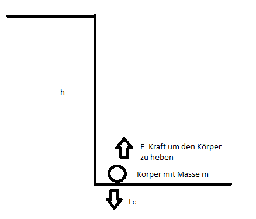

## 4.5.1 Arbeit

**Symbol**: W, E  

**Einheit**: Joule /J  

Arbeit wird immer dann verrichtet, wenn ein Körper mit der Masse m durch eine Kraft F entlang eines Weges s bewegt wird.  

**Einfügen Formel**: $Arbeit=Kraft\cdot  weg$  

$$
W=F\cdot s
$$

**Die Einheit Joule**  

$Joule= Newton\cdot  Meter$  

Die vollständige Formel für die Arbeit ist ein Skalarprodukt  

Wenn $Fparallel zu s ist, dann ist w max.$  

$Wenn F normal zu s ist, dann ist w min.$  

Die Formel für die Arbeit bietet die Möglichkeit bei gleichbleibender Arbeit, die Kraft und den Weg so zu verändern, dass der eine Wert, zb. die Kraft größer wird und der andere Wert kleiner.  

## 4.5.2 Leistung

**Symbol**: P  

**Einheit**: Watt/W  

**Formel**: $P=\frac{W}{t}$  

**Definition**: die Leistung gibt an, wie viel Arbeit in einer bestimmten Zeit verrichtet wird. Wenn man eine bestimmte Strecke unterschiedlich schnell läuft, verrichtet man dieselbe Arbeit, braucht aber mehr Leistung.  

==Die Einheit Kilowattstunde (kWh)==  

Diese Einheit ist eine Energieeinheit und keine Leistungseinheit! Aus der Formel $W=E=P\cdot t$ flogt: 1 kWh=1000 Wh=3600000 Joule.  

## 4.5.3 Energie

**Symbol**: E/W – Energie=Arbeit  

**Einheit**: Joule/J  

**Definition**: Energie ist die Fähigkeit, Arbeit zu verrichten. Immer wenn Arbeit verrichtet wird, geht Energie von einem Körper auf einen anderen über. Die Verrichtung von Arbeit bedeutet immer Energieumwandlung.  

Wir untersuchen die beiden wichtigsten Energieformen in der klassischen Mechanik:  

**a) Kinetische Energie bzw. Bewegungsenergie bzw. Beschleunigungsarbeit **  

**Symbol**: EKin  

**Definition**: Unter der Beschleunigungsarbeit versteht man jene Arbeit, die nötig ist, um einen Körper mit der Masse m zu beschleunigen. Diese Beschleunigungsarbeit steckt dann in Form kinetischer Energie im Bewegten Körper, solange er sich im Bewegungszustand befindet. Da die Geschwindigkeit relativ zum Beobachter ist, ist auch die kinetische Energie eine relative Größe.  

Herleitung der Formel für EKin:  

**Ansatz:**  

$$
F=m\cdot a     v=a\cdot t    w=F\cdot s    s=\frac{at^{2}}{2}
$$

$$
W=m\cdot a\cdot s
$$

$$
W=\frac{m\cdot a^{2}\cdot t^{2}}{2}
$$

$$
E_{Kin}=\frac{m\cdot v^{2}}{2}
$$

**b) Potenzielle Energie (im Gravitationsfeld) bzw. Hubarbeit bzw. Lageenergie **  

**Symbol**: EPot  

Die Hub- oder Hebearbeit entspricht der Arbeit, die nötig ist, um einen Körper mit der Masse m gegen die Schwerkraft in eine bestimmte Höhe h zu heben. Diese geleistete Arbeit steckt dann gleichsam in Form potenzieller Energie im gehobenen Körper, solange er sich auf der Höhr h befindet, was gespeicherter Arbeit entspricht.  

Herleitung der Formel für EPot:  

**Ableitung:**  

$$
W=E=F\cdot s
$$

$$
E_{pot}=m\cdot g\cdot h
$$

g= 9,81 m/s2  

**Beispiel**: Flugzeug fliegt mit 946 km/h in einer Höhe von 11867 m und hat eine Masse von 66400. Höhere kinetische oder potentielle Energie.  

**v=262,8**  

EPot= $66400\cdot 9,81\cdot 11867=7 729 973 928$  

$E_{Kin}=\frac{66400\cdot 7 729 973 928}{2}=2,3\cdot 10^{9}$EPot=EKin= 3519m  

**Energieumwandlungsprozesse/Energieerhaltung (Buch, Seite 53-55)**  

**Energieerhaltungssatz**: In einem abgeschlossenen System bleibt die Gesamtenergie bei allen Vorgängen innerhalb des Systems konstant. Die Gesamtenergie ist die Summe aller Energiearten. Diese können innerhalb des Systems ineinander umgewandelt werden.  Ein abgeschlossenes System hat idealerweise keinen Energieaustausch mit seiner Umgebung.  

Mathematische Formulierung:  

**$E_{G}=Gesamtenergie$**  

$$
E_{G}=konstant
$$

$$
E_{G}=E_{Kin}+E_{Pot}+…=konstant
$$

$$
E_{G}=\frac{m\cdot v^{2}}{2}+mgh=konstant
$$

$$
\frac{m\cdot v^{2}}{2}=mgh
$$

$$
v=\sqrt{2gh}^{2}
$$

## 4.5.3 Impuls

Der Impuls ist eine bedeutende Größe in der Mechanik, die man jedem Körper mit der Masse m zuordnen kann, wenn er eine Geschwindigkeit v besitzt (der Impuls ist damit genauso relativ wie die Geschwindigkeit v). Von zentraler Bedeutung ist dabei, dass der Impuls ein Vektor ist.  

**Formel**: $p=m\cdot v$  

**Impulserhaltungssatz:** In einem abgeschlossenen System bleibt der Gesamtimpuls, das ist die Summe der einzelnen Impulse, konstant. Dabei muss wiederum der Vektor Character des Impulses berücksichtigt werden.  

**$p_{G}=Gesamtimpuls$**  

$$
p_{G}=p_{1}+p_{2}+p_{3}+…
$$

**Drehimpuls L**  

$$
L=m\cdot v\cdot r
$$

