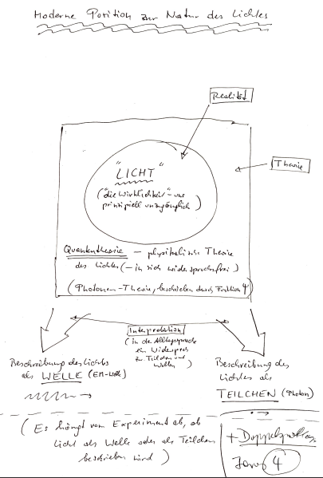
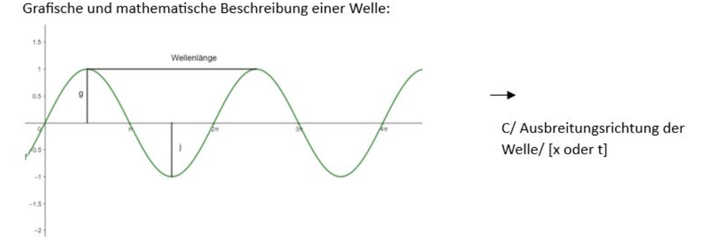

## 6.2.1 Einige Bemerkungen zur Quantenphilosophie

Es gibt einen Unterschied zwischen dem, was wir sehen und dem was wir wahrnehmen. Eine Zeichnung ist eine Ansammlung an Strichen, aber wir nehmen den Menschen war, den diese Linien für uns bilden. Ähnlich ist es mit der Quantenoptik; sowohl Teilchen als auch Welle beschreiben das Licht.  

In der Quantentheorie gibt es keinen Widerspruch zwischen Welle und Teilchen.  

Wenn man bei der Mathematik bleibt, hat man kein Problem, sobald man Anfang zu denken, muss man Welle und Teilchen getrennt betrachten.  

## 6.2.2 Licht als Welle betrachtet/Einführung in die Grundlagen der Wellenphysik

Dies ist eine allgemeine Einführung, die für alle Wellen Gültigkeit besitzt (Wasserwellen, Schallwellen, Erdbebenwelle).  

Während eine Schwingung ein zeitlich periodisch veränderlicher Vorgang ist und auf ein relativ kleines Raumgebiet beschränkt ist, ist eine Welle ein räumlich und zeitlich periodisch veränderlicher Vorgang der Energieausbreitung. Kurzgesagt ist eine Welle eine sich regelmäßig fortpflanzende Energie.  

Wellen in Medien, wie zum Beispiel Wasserwellen: Werden Moleküle oder Atome  in einem deformierbaren Medium verschoben bzw. aus der Ruhelage ausgelenkt so bleibt diese Verschiebung nicht auf das Erregungszentrum beschränkt, sondern teilt sich den Nachbargebieten mit, die zeitlich verzögert ebenfalls deformiert bzw. verändert werden. ==>Die Welle pflanzt sich mit einer für das Medium typische Ausbreitungsgeschwindigkeit fort.  

Zb. Schallgeschwindigkeit: Cs=340 m/s  

## 6.2.3 Graphische und mathematische Beschreibung einer Welle

$$
π=180°
$$

$$
2 π=360°
$$

E=Elongation: Auslenkung an einer beliebigen Stelle. Die physikalische Bedeutung der Elongation und der Amplitude hängt von der Art der Welle ab: Bei Wasserwellen zum Beispiel ist die Elongation eine räumliche Länge, bei elektromagnetischen Wellen hingegen ist Elongation ein Maß für die elektrische bzw. magnetische Feldstärke.  

**Amplitude**: Maximale Auslenkung einer Welle aus der Ruhelage (die Einheit von Elongation und Amplitude hängt von der Art der Welle ab)  

Wellenlänge=λ (Einheit Meter): Die Wellenlänge ist der Abstand zwischen zwei Punkten einer Welle, die sich im selben Schwingungszustand befinden.  

Frequenz=f (Einheit Hertz, Hz, $1Hz=\frac{1}{s}$): Die Frequenz gibt die Anzahl der Schwingungen pro Sekunde an.  

Schwingungsdauer=T (Einheit Sekunde, s): Die Schwingungsdauer ist die Zeitdauer einer vollständigen Schwingung.  

$Wellengeschwindigkeit=c \left(Einheit \frac{m}{s}\right)$  

**Schwingungsphase/Phase**: Entfernung eines Schwingungszustandes einer Welle von einem beliebigen Punkt (zum Beispiel von einer weiteren Welle).  

Einige zentrale Formeln:  

$$
c_{0}=λ\cdot f=konstant=3\cdot 10^{8}m/s
$$

$c_{0}=Lichtgeschwindigkeit im Vakuum$  

**$λ=Wellenlänge$**  

**$f=Frequenz$**  

$$
\frac{1}{f}=T
$$

$$
f=\frac{1}{T}
$$

**Beispiel**: Wie groß ist die Wellenlänge eines UKW-Senders, der mit 88.6 MHz sendet?  

$$
3\cdot 10^{8}=λ\cdot 88.6\cdot 10^{6}
$$

$$
λ=\frac{3\cdot 10^{8}}{88.6\cdot 10^{6}}=3.3m
$$

## 6.2.4 Interferenz:

Interferenz nennt man Überlagerung von Wellen, dabei gibt es zwei Extremformen: Konstruktive und destruktive Interferenz.  

$Δ φ=Phasenverschiebung$  

$$
Δ φ=0; 2π etc.
$$

$$
Δ φ= π; 3 π
$$

Wir unterscheiden zwei wesentliche Typen von Wellen:  

a)  Transversalwellen: Bei Transversalwellen ist die Schwingungs- bzw. Auslenkungsrichtung normal zur Fortpflanzungs- bzw. Ausbreitungsrichtung. Beispiele: Elektromagnetische Wellen, Wasserwellen, Federwellen.  

b) Longitudinalwellen: Bei Longitudinalwellen ist die Schwingungs- bzw. Auslenkungsrichtung parallel zur Fortpflanzungs- bzw. Ausbreitungsrichtung. Beispiele: Schallwellen, Federwellen.  

## 6.2.5 Entsprechung von Welle und Teilchenbestimmungsgrößen

| Unsere Wahrnehmungswelt | Wellen-Diskurs | Teilchen-Diskurs |
| --- | --- | --- |
| Farbe | Frequenz f: Blau hat eine höhere Frequenz als rot | Energie des Photons: Blaue Photonen haben eine höhere Energie als rote. ( |
| Helligkeit | Amplitude A: Je höher die Amplitude, desto heller. | Intensität I : Anzahl der Photonen. Je mehr Photonen, desto heller. |

## 6.2.6 Beugung

Beugung nennt man das Abweichen der Wellenausbreitung von der Geradlinigkeit.  

