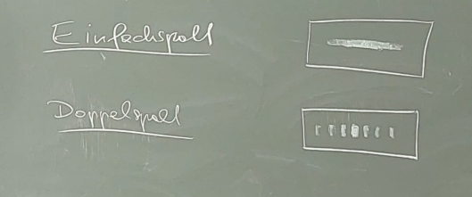
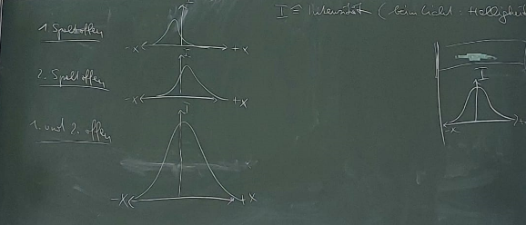
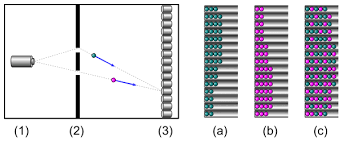
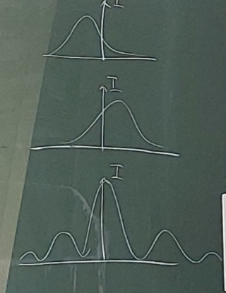
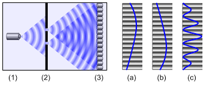
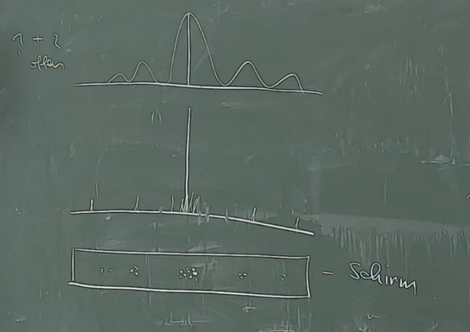
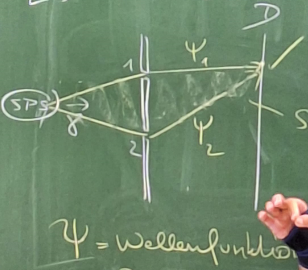
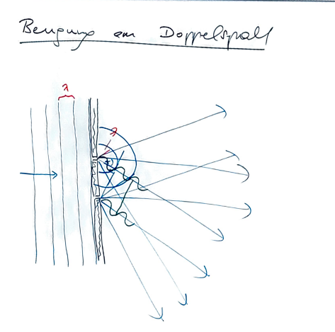
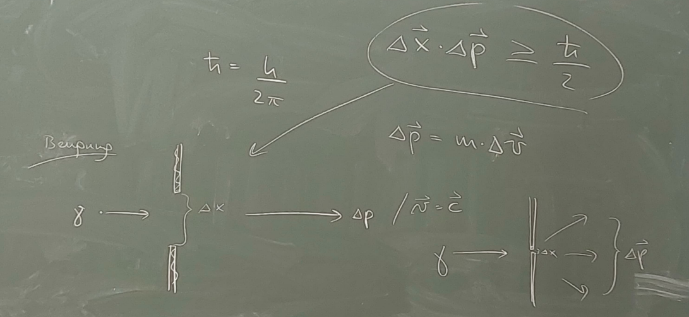

Interpretationen des Experiments:  

6.4.1 Doppelspaltexperiment mit klassischen Teilchen (zum Beispiel Bälle). Allerdings kommt es theoretisch zu einem anderen Ergebnis als praktisch. Das Licht ist also kein klassisches Teilchen.  

Die Untere Abbildung zeigt, wie sich klassische Teilchen mit dem Doppelspalt verhalten. Bei Fall a ist nur der obere Spalt geöffnet, bei b der untere und bei c beide.  

6.4.2 Doppelspalt Experiment mit klassischen Wellen (zum Beispiel Wasserwellen)  

Zunächst ist der obere, dann der untere, schließlich beide Öffnungen geöffnet. Ergebnis c schaut so aus wie das echte Ergebnis. Im 19. Jahrhundert war das genug, um zu postulieren, dass sich Licht wie eine klassische Welle verhält.  

6.4.3 Doppelspalt Experiment mit Teilchen im Sinne der Quantenphysik (Zum Beispiel Photonen, Elektronen, Neutronen, Atome, Moleküle (bis zu 1000 Atome), bald vielleicht Viren)  

Es werden nur einzelne Teilchen emittiert und nicht viele auf einmal. Im klassischen Wellenmodell kann man die Intensität theoretisch immer weiter gegen null senken, was gegen die Quantenoptik spricht, da wenn man vom Teilchen ausgeht, irgendwann nur noch ein Photon fliegt und nur an einem Ort aufkommen kann. Wenn ein Photon ausgesendet wird, verhält sich das Muster nicht wie das einer klassischen Welle, sondern hat nur einen „Peak“. Hieraus kommt der Begriff Welle-Teilchen Dualismus. Licht hat sowohl die Eigenschaften von Welle (viele Photonen) als auch die eines Teilchens (ein Photon).  

Wird ein Photon nach dem anderen abgeschossen, wird nach einiger Zeit wieder das Intensitätsmuster der Welle und nicht das des klassischen Teilchens auftreten. Um das zu erklären, muss man akzeptieren, dass ein Photon gleichzeitig durch beide Spälte kommt, was es allerdings nicht kann, da es sich nicht teilen kann. Die Interferenz entsteht also, weil das Photon durch beide Spälte geht und mit sich selbst interferiert, da es ja nichts anderes gibt, womit es wechselwirken könnte.  

Solange das Photon nicht gemessen wird, befindet es sich in einer Superposition, da es zwei Wege einschlagen kann, um ein Ziel zu erreichen. Erst mit der Messung ist eindeutig, welchen Weg es genommen hat. Dadurch, dass es beide Wege zurücklegt, können diese miteinander interferieren. $\left(ψ^{2}\right)$ gibt also die Wahrscheinlichkeit für die Orte an, an denen das Photon aufkommt. Man muss den Betrag nehmen, da $ψ$ ein komplexer Ausdruck ist.  

## 6.4.4 Dekohärenz

Das ist der Begriff, der beschreibt, dass bei einer Messung die Wellenfunktion auf einen Peak zerfällt und damit einer der vielen Zustände bevorzugt wird. Dabei weiß man nicht warum die Welle zerfällt. Ein Beispiel dafür ist Schrödingers Katze. Eine Katze und ein Apparat sind in einer Box. Dieser Apparat besteht aus einem radioaktivem Isotop, dass, wenn es zerfällt einen Mechanismus auslöst, der die Katze umbringt. Wenn man nicht in die Box schaut, ist die Katze theoretisch also gleichzeitig tot und lebendig.  

Je mehr Teilchen ein System in einem Superpositionszustand hat umso viel kürzer ist die Dekohärenzzeit, also die Zeit bis die Superposition endet.  

Physik +:  

Beugung am Doppelspalt  

$$
Δx\cdot Δp≥\frac{h}{2π}
$$

$$
Δp=m\cdot Δv
$$

Zu einem Zeitpunkt kann man Ort und Impuls nicht genau bestimmen. Das gleiche gilt für Energie und Zeit.  

## Friedl-Ergänzung: Vergleich der drei Doppelspaltbilder

| Fall | Was kommt einzeln an? | Gesamtbild nach vielen Ereignissen | Schluss |
| --- | --- | --- | --- |
| Klassische Teilchen | Teilchen | zwei Häufungen | keine Interferenz |
| Klassische Wellen | Wellenfront | Interferenzmuster | Wellen überlagern sich |
| Quantenobjekte | einzelne Treffer | Interferenzmuster | Treffer sind teilchenhaft, Wahrscheinlichkeitsverteilung ist wellenhaft |

==Das Quantenobjekt ist nicht "halb Welle, halb Teilchen". Es wird je nach Experiment mit Wellen- oder Teilchenbegriffen beschrieben.==

Wenn man den Weg misst, wird aus der Superposition ein bestimmter Messausgang. Dadurch verschwindet das Interferenzmuster.

Weiter mit [Materiewellen und Unschärfe](./05_materiewellenUndUnschaerfe.md).

