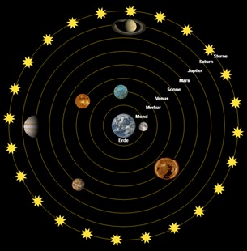
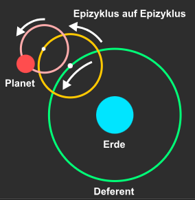
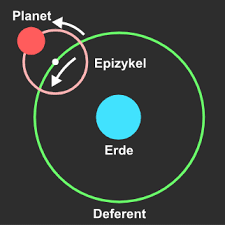
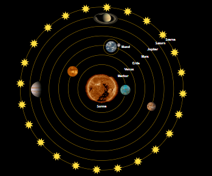

Zentraler Bestandteil von jeder Kultur: Was ist das Universum? Hat spirituelle Gründe.  

Die Kosmologie (gr. Kosmos=das geordnete, schöne, ganze) beschäftigt sich mit dem Universum. Im Gegensatz zu Chaos (Abgrund, Ungeordnete) wird dem Universum mit dem Begriff Kosmos Ordnung zugeschrieben und ist positiv behaftet.  

## 7.1.1 Aristoteles:

Entwickelt geozentrisches Weltbild.  

In diesem Weltbild bewegen sich die Planeten (und die Sonne) kreisförmig und nicht in Ellipsen, während die Erde ruht.  

Außerhalb des Sonnensystems befindet sich laut dem Modell die sogenannte Fixsternsphäre. Diese bewegen sich im Gegensatz zu den „Wandelsternen“, welche die restlichen Planeten sind, nicht. Es wurde davon ausgegangen, dass die Fixsterne an einer kugelförmigen, materiellen Sphäre angebracht sind, die sich in 24 Stunden um die Erde dreht.  

Von den Scholastikern wurde am äußersten Rand noch das Himmelreich und im Erdinneren die Hölle hinzugefügt.  

7.1.2 Psychokosmologie: Beschäftigt sich mit der tiefenpsychologischen Bedeutung von Weltbildern.  

Ein Grund, der für dieses Weltbild spricht, ist der, dass sich alles um uns drehen würde. Sowohl räumlich als auch im übertragenen Sinne.  

Ein anderer, spekulativer Ansatz besagt, dass das Modell einem Mutterleib ähnelt. Es suggeriert Schutz und Geborgenheit, da sich alles um uns hüllt. Contraire dazu lässt sich behaupten, dass auch eine Art Gefangenschaft aus dem geozentrischen Weltbild spricht.  

## 7.1.3 Ptolemäus (87-165 n. Chr.)

Astronom, der an das Aristotelische Weltbild glaubte. Er beobachtete den Mars am Nachthimmel und zeichnete täglich seine Position auf einer Karte ein. Durch die eingezeichneten „Planeten-Orte“ konnte er die Bahnbewegung des Mars beobachten. Dabei stellte er fest, dass die Bewegung nicht konstant war, sondern immer wieder Kehrtwenden beschrieb, was dagegen spricht, dass sich der Mars kreisförmig  um die Erde bewegt.  

Als Lösung und zur Rettung des geozentrischen Weltbilds stellte er folgende ad hoc Hypothese auf: Die Epizykel-Theorie besagt, dass sich der Mars nicht nur auf einer Kreisbahn um die Erde befindet, sondern in dieser Bahn um einen weiteren Mittelpunkt kreist. Die Bewegung des Mondes relativ zur Sonne (aus heutiger Sicht) ist damit vergleichbar. Physikalisch konnte Ptolemäus nicht erklären, wie dieser Epizykel funktionieren würde. Das störte jedoch niemanden, man sah es eher als Beweis.  

Dieses Modell funktionierte nicht für alle Planeten, weswegen ein Epizykel auf einem anderen Epizykel entworfen wurde.  

Doch warum benötigt man ein funktionierendes System? Die Kirche benötigte ein Weltbild für die Daten von Feierlichkeiten, Seefahrer benutzten Sterne zur Orientierung und für Zeitmessung war es auch ganz praktisch.  

## 7.1.4 Kopernikus (1473-1543)

Mit der sogenannte Kopernikanischen Wende wurde das heliozentrische Weltbild eingeführt und löste das geozentrische ab. Zu dieser Zeit war Uranus nach wie vor nicht bekannt. Ebenso wurde vom geozentrischen Weltbild übernommen, dass sich die Planeten auf kreisförmigen Bahnen bewegen.  

Auch wurde der Erde der Ruhezustand abgesprochen, man erklärte sich Sonnen Auf- und Untergang, damit, dass die Erde in 24 Stunden enmal um sich selbst rotiert. Dadurch ist auch die Fixsternsphäre unbewegt.  

Die rückläufigen Bewegungen von Planeten erklären sich durch unterschiedliche Geschwindigkeiten der Planeten zueinander.  

Um nicht mit der Kirche in Konflikt zu geraten, ließ er sein Werk, dass das heliozentrische Weltbild beschrieb, erst kurz vor seinem Tod drucken. Ebenfalls war seine Arbeit sehr komplex und mathematisch verfasst, wodurch die wenigsten Wissenschaftler zur damaligen Zeit in der Lage waren, sein Werk zu verstehen.  

Außerdem verfasste er seine Entdeckung nicht apodyktisch (Es ist), sondern hypothetisch (Es könnte sein).  

## 7.1.5 Galileo Galilei (1564-1642)

Galilei ist der erste, der das heliozentrische Weltbild apodiktisch vertritt, wobei auch er noch immer von Kreisbahnen ausging. Er lehrte, dass das geozentrische Weltbild falsch und das heliozentrische nicht nur eine absurde Theorie, sondern korrekt sei. Dadurch lenkte er die Aufmerksamkeit der Kirche auf sich.  

Nachdem zwei Jahre zuvor das Teleskop erfunden wurde, baute Galilei selbst eines. Er war allerdings der Erste, der das Teleskop für Himmelsbeobachtungen einsetzte. Davor wurde es für Feindaufklärung verwendet.  

Eine seiner Beobachtungen waren die vier großen Jupiter-Monde. Für Galilei ist das ein starkes Argument gegen das geozentrische Weltbild. Einerseits, da Aristoteles keine anderen Monde berücksichtigte, andererseits, da sie nicht direkt um die Erde kreisen, was dem Grundsatz des Erdmittelpunkt des Universums widersprach. Ebenfalls drehen sich hier kleiner Körper um die größeren, was auch auf das Sonnensystem übertragen wurde, da man zu diesem Zeitpunkt bereits wusste, dass die Sonne sehr groß ist.  

Eine weitere Beobachtung waren Sonnenflecken. Diese dunklen Stellen sprachen gegen die Ästhetik der Scholastiker, die sich Himmelskörper als vollkommen und perfekt vorstellten.  

Ein drittes Argument gegen Aristoteles dreht sich um den Mond und seine Topographie. Bei näherer Beobachtung gibt es tiefe Krater, Gebirge und Gräben. Ebenso wie die Sonne war der Mond als makellos beschrieben was hiermit widerlegt war. Da einige Unebenheiten auch mit freiem Auge zu sehen waren, also bevor voriges Argument geliefert wurde, sprach man von atmosphärischen Phänomenen, die die Sicht auf den Mond störten.  

## 7.1.6 Giordano Bruno (1548-1600)

War eine sehr schwierige Persönlichkeit. Ein richtiger Ungustl, weswegen er verbrannt wurde. Abgesehen von seiner Eigenschaft allen am Nerv zu gehen, hat er sich auch in den Weltbilderstreit eingemischt. Er erklärte die Fixsternsphäre als falsch und behauptet, dass das Universum unendlich groß ist und sich die Sterne nach unserem Sonnensystem unendlich fortsetzen. Daraus folgert er, dass es unendlich viele Sterne gibt, die ebenfalls von Planeten umkreist werden. Demnach würde es ebenso unendlich viele bewohnte Himmelskörper geben. Auch er geht noch von Kreisbahnen aus.  

## 7.1.7 Tycho Brahe

Entwickelte ein Weltbild, bei dem die Sonne um die Erde kreist und alle anderen Planeten um die Sonne. Außerdem erhielt Kepler von ihm Aufzeichnungen über Planetenorte.  

## 7.1.8 Kepler (1571-1630)

In dieser Zeit war es selbstverständlich, dass Planeten sich kreisförmig bewegen. Kepler war der erste, der die Diskrepanzen zwischen Theorie und Beobachtung feststellte, da die Planetenorte keine Kreisbahn ergaben. Er folgerte, dass die Bahnen Ellipsen sind. Ab diesem Zeitpunkt wurde das heliozentrische Weltbild endgültig akzeptiert, da man mit der Ellipsen-Theorie ein besser funktionierendes Weltbild als das geozentrische hatte.  

## 7.1.9 Newton (1643-1727)

Er entwickelte die erste Theorie der Gravitation: Die klassische Gravitationstheorie.  

## 7.1.10 Einstein (1915)

Entwickelte 1915 die heutige Gravitationstheorie: Die allgemeine Relativitätstheorie. Diese ist allerdings unvollständig, zum Beispiel kann sie das innere von schwarzen Löchern nicht erklären. Heute sucht man nach einer Quantengravitation.  

