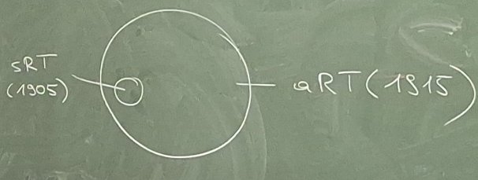
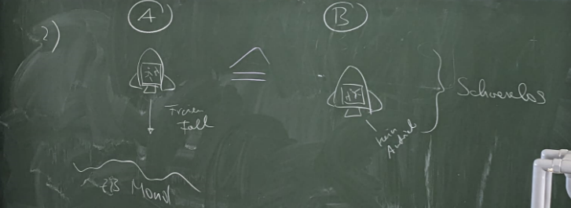
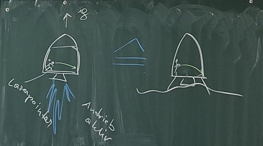
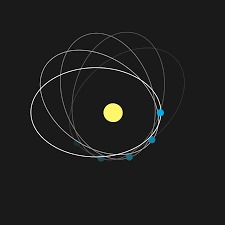
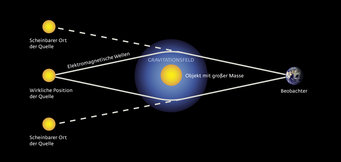
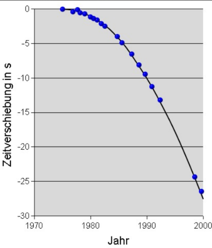

Basiswissen 8, Seite 22-25  

Die Spezielle Relativitätstheorie behandelt unbeschleunigte, die allgemeine auch beschleunigte Systeme.  

## 7.2.1 Das Äquivalenzprinzip

Besagt, dass im freien Fall ein jeder Körper schwerelos ist. System A und B sind komplett äquivalent. Wenn man im Raumschiff ohne Fenster sitzt, kann man nicht feststellen, ob man beschleunigt oder man sich auf Erdboden befindet.  

Daraus ergibt sich, dass es keinen Unterschied zwischen Gravitation und beschleunigten Systemen gibt.  

Beide sind schwerelos. A fällt und B ist sehr weit weg von jedem massereichen Objekt. Auch hier geht man davon aus, dass es kein Fenster gibt.  

Gemäß dem Äquivalenzprinzip laufen sämtliche mögliche Experimente in beiden Zuständen A und B in Fall 1, sowie in beiden Zuständen A und B in Fall 2 vollkommen gleich ab! Laut der Allgemeinen Relativitätstheorie gibt es kein einziges Experiment, mit dem man unterscheiden könnte, in welchem der beiden gleichen Zustände man sich befindet.  

Wirkt auf ein System nur die Schwerkraft und sonst keine andere Kraft, dann ist man innerhalb des Systems schwerelos.  

**Beispiel**: Gedankenexperiment  

Hier sieht man den Beweis, dass Licht durch Gravitation beeinflusst wird, da beide Systeme gleich sind.  

Einstein erklärt weiters die Gravitation nicht wie Newton als eine Anziehungskraft zwischen Massen, er behauptet, dass die Gravitation eine Konsequenz der sogenannten Raumkrümmung ist. Wir können uns das nicht vorstellen, da man für die Krümmung immer eine weitere Dimension benötigt.  

## 7.2.2 Einige Effekte der allgemeinen Relativitätstheorie

1. Die Periheldrehung des Merkur: Perihel beschreibt den Sonnennächsten Punkt auf einer Planetenbahn. Sein Perihel ist nicht wie zuvor angenommen konstant, sondern „eiert“. Es bewegt sich um einige Bogensekunden pro Jahr. Die erste Theorie war, dass es einen noch Sonnennäheren Planeten gibt, der die Bahn des Merkur beeinflusst. Jedoch wurde er nie gefunden. Ebenso konnte die Periheldrehung nicht vollständig mit der klassischen Physik erklärt werden, erst Einstein hat sie im Rahmen der ART durch das Gravitationsfeld der Sonne erklärt. Das ist der Fall, da das Gravitationsfeld der Sonne selbst Masse hat.  

2. Ablenkung von Licht im Gravitationsfeld schwerer Himmelskörper (Sterne, Galaxien, Neutronensterne, schwarze Löcher): Objekte, die wir von der Erde aus beobachten, sehen wir treilweise mehrfach, da das Licht in seiner Bahn zu uns von der Gravitation beeinflusst wird. Zu der Abbildung ist anzumerken, dass die Krümmung nicht ein Eck, sondern eine konstante, runde Krümmung ist. Die erste Mesung der Lichtablenkung geschah 1915 durch Arthur Eddington im Zuge einer Sonnenfinsternis in Westafrika.  Ein halbes jahr zuvor lichtete er den Sternenhimmel ab, ebenso während der Sonnenfinsternis. Wenn man die Bilder vergleicht, sind die Sterne an anderen Positionen. Genauer gesagt rücken sie etwas nach außen.  

3. Gravitationswellen: Maxwell hat elektromagnetische Wellen um das Jahr 1860 entdeckt. Außerdem fand er heraus, wie man sie ezeugen kann und zwar, indem Ladungen beschleunigt werden.  

$$
\frac{d^{2}E}{dt^{2}}≠0
$$

Diese Formel ist die zweite Ableitung der Elektrischen Feldstärke nach der Zeit. Wenn der Term nicht gleich Null ist, entstehen elektromagnetische Wellen. Durch das veränderliche elektrische Feld entsteht ein veränderliches magnetisches Feld usw.  

Einstein überträgt dieses Prinzip auf beschleunigte Massen. Diese verursachen somit Gravitationswellen. Gravitationswellen sind allerdings sehr schwer nachzuweisen, da die Gravitation im Vergleich zum Elektromagnetimus um den Faktor $10^{40}$ schwächer ist. Um sie also messen zu können, braucht man ein extrem massereiches Objekt in der Größenordnung ab Neutronensternen. Durch diese Wellen wird der Raum selbst verändert, das heißt, dass er „kontrahiert“ und „expandiert“.  

Zum ersten Mal wurden Gravitationswellen 2015 mithilfe von zwei sich umkreisenden schwarzen Löchern nachgewiesen. Sie nähern sich immer weiter an, da sie Energie abstrahlen und dadurch langsamer werden. Dadurch, dass sie einander näher kommen, beschleunigen sie weiter und strahlen so immer mehr Energie in Form von Gravitationswellen ab. Dadurch wird die Amplitude der Wellen ebenso größer. Dieser Prozess setzt sich fort, bis sie verschmelzen bzw. fusionieren, wobei am meisten Energie abgestrahlt wird.  

LIGO – Messung von Gravitaionswellen: Gravitationswellen wurden auf einem Maßstab von etwa 10-18 Metern mithilfe von Interferenzerscheinungen festgestellt. Wenn Gravitationswellen auf die Messstation treffen, schwingt das Interferenzmuster mit der Welle mit.  

Der Physiker Taylor untersuchte ein Doppelsystem von Pulsaren, das sind Neutronensterne mit starken Magnetfeldern. Er führte die erste indirkete Messung von Gravitationwellen durch. Die Punkte sind die Messungen und die gezeichnete Kurve ist die Vorhersage von Einsteins allgemeiner Relativitätstheorie.  

## Friedl-Ergänzung: LIGO, LISA und Hulse-Taylor

**Hulse-Taylor-Doppelsternsystem:**  
Ein Pulsar und ein Neutronenstern umkreisen einander. Ihre Umlaufperiode wird langsam kleiner. Das passt zur Vorhersage, dass das System Energie als Gravitationswellen abstrahlt.

==Hulse-Taylor war ein indirekter Nachweis von Gravitationswellen. LIGO war der erste direkte Nachweis.==

**LIGO:**  
LIGO misst extrem kleine Längenänderungen mit Interferenz. Eine Gravitationswelle staucht und streckt den Raum minimal; dadurch verschiebt sich das Interferenzmuster.

**LISA:**  
LISA ist als Gravitationswellen-Observatorium im Weltraum gedacht. Mehrere Satelliten bilden dabei ein riesiges Interferometer. Das Prinzip ist ähnlich wie bei LIGO, aber mit viel größeren Abständen.

**Merksatz:**  
==Gravitationswellen sind periodische Änderungen der Raumzeit, nicht Schallwellen in einem Medium.==

