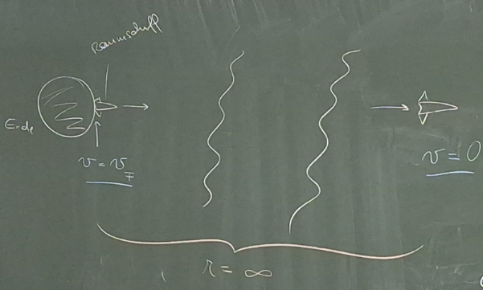

Die Fluchtgeschwindigkeit ist jene Geschwindigkeit eines Körpers (zum Beispiel Raumschiff), die der Körper an der Oberfläche des Himmelskörpers braucht, damit er dem Schwerefeld für immer entkommen kann und nie mehr wieder zurückfällt. Exakte Definition: Startet ein Objekt mit der Fluchtgeschwindigkeit, dann hat es nach unendlich langer Zeit in unendlich weiter Entfernung exakt die Geschwindigkeit von Null m/s.  

Genauere Beschreibung der Flugdynamik: Wird das Raumschiff von der Oberfläche eines Planeten mit $v_{f}$ weggeschossen, dann entfernt es sich zunehmend vom Himmelskörper. Da die Gravitation der Erde auf das Raumschiff wirkt, wird es immer langsamer. Außerdem wirkt die Gravitation auf das Raumschiff mit größerer Distanz immer geringer, heißt die momentane Änderung der Beschleunigung ist negativ. Herleitung:  

**$E_{G}=Gesamtenergie$**  

$E_{Kin}=Kinetische Energie$  

$E_{Pot}=Potentielle Eergie$  

$$
E_{G}=E_{Kin}+E_{Pot}
$$

$$
E_{Kin}=\frac{m\cdot v^{2}}{2}
$$

$$
E_{Pot}=m\cdot g\cdot h
$$

Beim Start gilt:  

$$
E_{G}=E_{Kin}
$$

Im Unendlichen gilt:  

$$
E_{G}=E_{Pot}
$$

Daraus folgt:  

$$
E_{Kin}=E_{Pot}
$$

$$
\frac{m\cdot v_{F}^{2}}{2}=m\cdot g\cdot h
$$

$$
\frac{v_{F}^{2}}{2}=g\cdot h
$$

$$
v_{F}^{2}=2\cdot g\cdot h
$$

Jetzt muss g ersetzt werden, da es in Wirklichkeit nicht konstant ist. Die Formel für die Gravitationsfeldstärke g lautet:  

$$
g=\frac{G\cdot M}{r^{2}}
$$

$$
v_{F}^{2}=\frac{2\cdot G\cdot M\cdot h}{r^{2}}
$$

$Da h und r equivalent sind, folgt:$  

$$
v_{F}^{2}=\frac{2\cdot G\cdot M}{r}
$$

$$
v_{F}=\sqrt{\frac{2\cdot G\cdot M}{r}}
$$

$Bei der Erde beträgt vF ungefähr 11200 m/s.$  

$$
E_{Pot}=-\frac{G\cdot m_{1}\cdot m_{2}}{r}
$$

Erklärung der Potentiellen Energie nach dem Formalismus von Newton:  

$$
E_{Pot}=\int F_{G}dx
$$

$$
\int \frac{G\cdot m_{1}\cdot m_{2}}{r^{2}}dx
$$

$$
G\cdot m_{1}\cdot m_{2}\cdot \int \frac{1}{r^{2}}dx
$$

$$
G\cdot m_{1}\cdot m_{2}\cdot -\frac{1}{r}
$$

$$
-\frac{G\cdot  m_{1}\cdot m_{2}}{r}
$$

Die Potentielle Energie integriert ist die Gravitationskraft und Die Gravitationskraft abgeleitet ist die Potentielle Energie.  

$$
E_{G}=\frac{m_{2}\cdot v^{2}}{2}-\frac{G\cdot m_{1}\cdot m_{2}}{r}
$$

Wenn die Energie negativ ist, ist der Körper gebunden, heißt er kann nicht entkommen. Seine Bahn ist also entweder Kreis oder Ellipse. Wenn die Energie 0 ist, dann ist die Fluchtgeschwindigkeit erreicht, die Bahn ist eine Parabel, wenn die Energie höher als 0 ist, dann ist die Bahn eine Hyperbel.  

