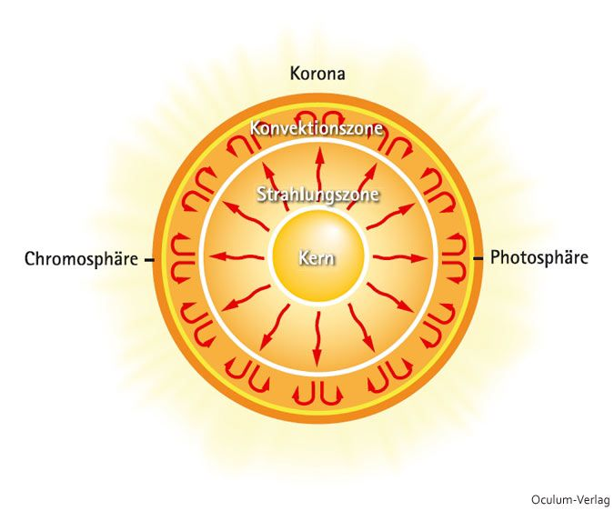
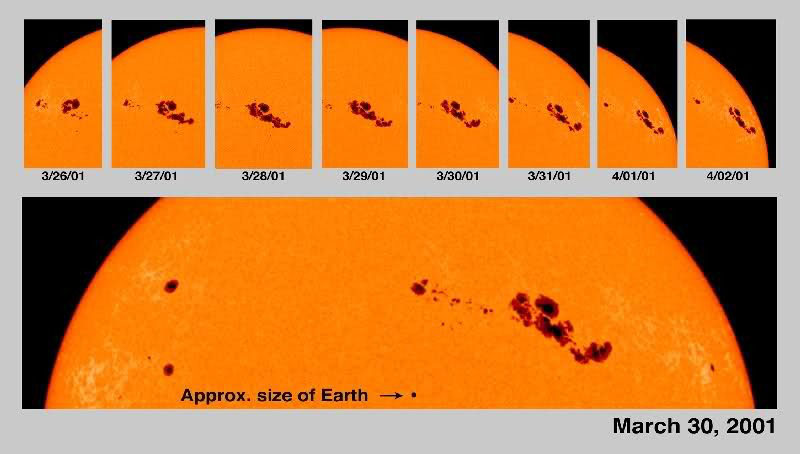
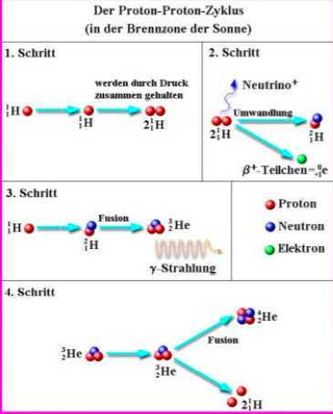

Es handelt sich bei unserer Sonne um einen Stern des G-Typs. Diese haben ungefähr eine Oberflächentemperatur von 6000 Grad Celsius. Sie bieten gute Möglichkeiten für Planetares Leben, da sie im Vergleich zu zum Beispiel blauen Riesen nicht viel schädliche Strahlung (UV und Röntgen) emittieren.  

Im Kern findet die Fusion statt und es hat etwa 15 Millionen Grad Celsius. Das liegt daran, dass die Atome von der Gravitation zusammengepresst werden und deswegen fusionieren, ergo Energie abgeben. Vom Kern tritt die Energie über die Strahlungszone (in Form von Strahlung) und die Konvektionszone (über Wärmefluss) nach außen. Vom Kern bis an die Oberfläche braucht die Energie etwa eine Million Jahre. Das liegt daran, dass die Photonen viel Materie im Weg haben, die es streuen. Es gibt Energie an die Elektronen im Atom ab und bekommt dadurch eine höhere Längenwelle. Im Kern entsteht Gammastrahlung, außen kommt sichtbares Licht an.  

In der Konvektionszone ist die Materie der Sonne in Bewegung. Diese kann mit Wasser im Kochtopf verglichen werden. Warmes Plasma steigt also auf, kühlt währenddessen ab und sinkt dann wieder ab.  

Sonnenflecken sind auf der Photosphäre, also auf der äußersten Zone der Sonne. Sie sind kühler als der Rest der Oberfläche und strahlen deswegen weniger Energie ab. Sie entstehen, wenn das Magnetfeld der Sonne die Konvektion stört, also das „kalte“ Plasma nicht wieder hinuntersinken kann.  

Zunächst wurde durch Berechnungen festgestellt, dass die Sonne nach 4.5 Mrd. Jahren nicht mehr Leuchten kann. Es wurde versucht die Sonne mit chemischer Verbrennung zu erklären, was falsch ist. 1905 veröffentlicht Einstein die Spezielle Relativitätstheorie die mithilfe der Formel $e=m\cdot c^{2}$ erklärt, dass Masse in Energie umgewandelt werden kann. Das ist die Grundlage der Kernfusion.  

## 8.1.1 Der Proton-Proton Zyklus

Er stellt die wichtigste Fusionsform der Sonne dar. Zwei Wasserstoffkerne werden zusammengedrückt. Sie können trotz der extrem starken elektrischen Abstoßung fusionieren, weil sie vom Druck so stark zusammengedrückt werden, dass sie in den Wirkungsradius der starken Kraft kommen, die sie aneinander bindet. Dafür müssen sie auf Kernnähe gebracht werden. Daraufhin passiert ein Beta-Zerfall: $p^{+}-→n+e+ν_{e}$. Dieser Prozess passiert relativ selten, da sich die zwei Kerne sehr schnell wieder voneinander Lösen. Das Neutrino ist natürlich neutral geladen. Es entsteht schwerer Wasserstoff, das Neutrino fliegt weg und das Positron anihilert. Zum Deuterium kommt ein weiteres Proton. Dadurch wird es zu einem Helium-3-Kern. Das ist die erste Fusion, wobei Gammastrahlung ausgestrahlt wird. Als nächstes fusionieren zwei Helium-3 Kerne und bilden Helium-4. Dadurch werden wieder zwei Protonen frei, die den Prozess wieder von vorne beginnen.  

Unsere Sonne hat momentan nicht die Energie auch Helium zu fusionieren. Das können zum Beispiel rote Riesen. Zum Ende ihrer Existenz wird die Sonne zu so einem. Die Sonne wird bis zu Kohlenstoff fusionieren können und nicht bis Eisen, was aufgrund der Kernbindungsenergie möglich wäre. Allerdings ist dafür mehr Energie vonnöten, als die Sonne hat. Beim Brennen von höheren Elementen wird ausßerdem viel mehr Energie frei, weshalb dieses Stadium nur sehr kurz anhält.  

