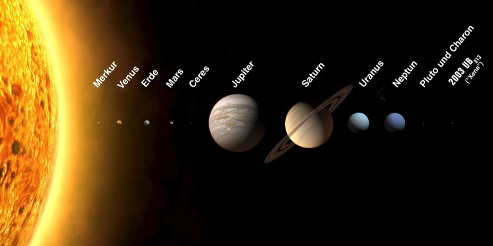

Die inneren vier Planeten befinden sich im Vergleich zu den äußeren sehr nahe an der Sonne. Diese Inneren sind Gesteinsplaneten. Sie haben eine feste Oberfläche und können eine Atmosphäre haben. Die großen Äußeren werden Gasriesen genannt. An der Oberfläche sind sie gasförmig, weiter innen flüssig und in der Mitte fest. Das liegt an dem hohen Druck. Die Abbildung zeigt nicht den echten Abstand, sondern zeigt primär die Maßstäbe der Größen der Planeten.  

## Inhalt

- [8.1 Die Sonne](./01_dieSonne.md)
- [8.2 Planeten des Sonnensystems](./02_planetenDesSonnensystems.md)
- [8.3 Äußere Planeten und besondere Monde](./03_aeusserePlanetenUndMonde.md)

## Einteilung

| Bereich | Körper | Merkmale |
| --- | --- | --- |
| Innere Planeten | Merkur, Venus, Erde, Mars | Gesteinsplaneten, feste Oberfläche, vergleichsweise nahe an der Sonne |
| Gas- und Eisriesen | Jupiter, Saturn, Uranus, Neptun | große Masse, keine feste Oberfläche im Alltagssinn, starke Atmosphären |
| Zwergplaneten und besondere Monde | Pluto, Titan, Enceladus, Europa | besonders interessant für Geologie, Atmosphäre oder mögliche Lebensbedingungen |

==Für Matura-Fragen ist nicht die Reihenfolge allein wichtig, sondern warum ein Himmelskörper so ist: Atmosphäre, Magnetfeld, Gravitation, Temperatur, Wasser und Strahlung.==

