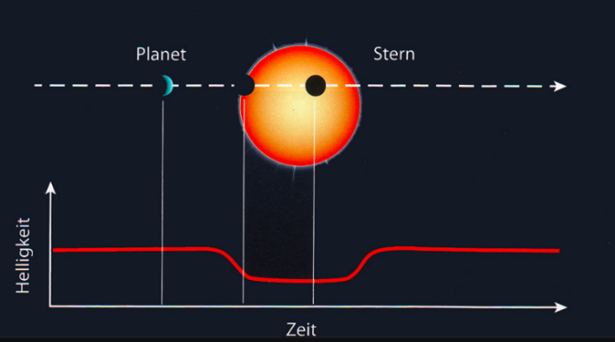
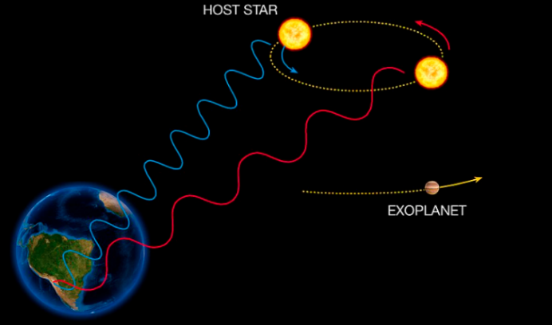
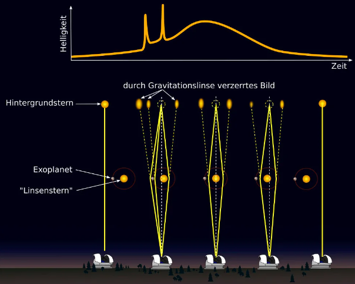

1995 wurde der erste Exoplanet, also ein Planet außerhalb unseres Sonnensystems, entdeckt. Früher dachte man, dass Planeten sehr selten sind, heute wissen wir, dass fast jedes Sonnensystem Planeten hat. So gibt es zum Beispiel einen Planeten, der ein dreifach-Sternsystem umkreist und in der habitablen Zone liegt.  

9.1.1 Beobachtungsmethoden  

Es ist stand heute sehr oft nicht möglich Exoplaneten direkt zu sehen, wobei hier unter anderem durch das James Webb Teleskop Fortschritte erreicht wurden. Stattdessen gibt es folgende Methoden: Die Transitmethode basiert auf Planeten, die ihre Sonnen horizontal umkreisen. Die Linie im Diagramm stellt die gemessene Helligkeit des Sternes dar. Wenn sich der Planet vor den Stern schiebt, dringt weniger Licht bis zur Erde durch. Je kleiner der Stern und je größer der Planet, desto größer ist die Verringerung des Lichtes. Viele Planeten wurden mithilfe des Kepler Teleskops gefunden.  

Die Doppler Verschiebungsmethode basiert auf dem Dopplereffekt. Wie in der Abbildung sichtbar, umkreisen Stern und Planet einen gemeinsamen Massenmittelpunkt. In diesem Fall ist er übertrieben dargestellt, oft liegt dieser Punkt in dem Stern und er „wackelt“ nur ein bisschen. Dadurch, dass sich der Stern also bewegt, verkürzt sich die Wellenlänge seines Lichtes (Blauverschiebung), wenn er sich auf uns zubewegt und die Wellenlänge wird länger (Rotverschiebung), wenn er sich von uns wegbewegt. Durch diese Verschiebungen lassen sich die Eigenschafen des Exoplaneten bestimmen. Man muss dabei auch noch andere Bewegungsfaktoren, wie die um das galaktische Zentrum bedenken, allerdings lassen sich diese mathematisch eleminieren, was hier den Rahmen sprengen würde.  

Eine weitere Methode ist die Gravitationslinsen Methode. Die Masse eines Sternes beeinflusst das Licht eines anderen Sternes. Wenn er einen Planeten hat, kann dieser eine weitere (sehr kleine Veränderung) hervorrufen. Diese Methode ist eher eine Randerscheinung, da die Messung sehr sensibel ist und extrem genau sein muss.  

Die letzte Methode ist die direkte Beobachtung. Man misst elektromagnetische Wellen (u. a. sichtbares Licht) von Exoplaneten.  

## Friedl-Ergänzung: Methoden im Vergleich

| Methode | Grundidee | Findet besonders gut | Grenze |
| --- | --- | --- | --- |
| Transitmethode | Planet verdunkelt Stern minimal | große, sternnahe Planeten | funktioniert nur bei passender Bahnebene |
| Radialgeschwindigkeit | Stern wackelt um gemeinsamen Schwerpunkt | schwere Planeten, Hot Jupiters | kleine erdähnliche Planeten sind schwer |
| Direkte Beobachtung | Licht des Planeten wird direkt gemessen | junge, große, weit entfernte Planeten | Stern ist viel heller als Planet |
| Mikrolinseneffekt | Gravitation verstärkt Licht eines Hintergrundsterns | auch weit entfernte Systeme | seltene, oft einmalige Ereignisse |

==Jede Methode hat einen Beobachtungsbias. Deshalb zeigt die Liste gefundener Exoplaneten nie direkt die echte Häufigkeit aller Planetentypen.==

**Hot Jupiters:**  
Sehr große Gasplaneten mit kurzer Umlaufzeit. Sie waren historisch auffällig, weil sie starke Signale in Transit- und Radialgeschwindigkeitsdaten erzeugen.

**Supererden und Mini-Neptune:**  
Planetentypen zwischen Erde und Neptun. Sie zeigen, dass andere Planetensysteme nicht einfach Kopien unseres Sonnensystems sind.

Weiter zu [erweiterten Lebensbedingungen](./03_erweiterteLebensbedingungenUndMatura.md).

