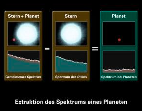
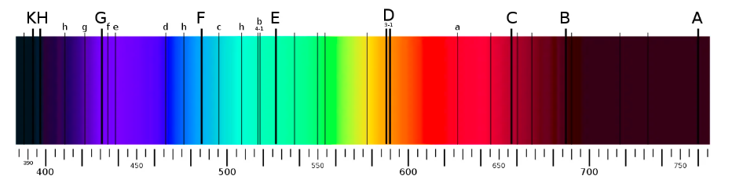

Die Habitable Zone ist der Bereich um einen Stern, in dem es flüssiges Wasser geben kann, ergo Leben existieren kann. Dabei ist zu erwähnen, dass der Aggregatzustand von Wasser (und allen anderen chemischen Elementen) nicht nur von der Temperatur (die ja vom Stern abhängt), sondern auch von anderen Faktoren, wie zum Beispiel dem Druck beeinflusst wird. Es kann also sein, dass Planeten in der habitablen Zone liegen, aber aufgrund des atmosphärischen Drucks kein flüsiges Wasser existiert.  

## 9.2.1 Spektroskopische Untersuchung der Planetenatmosphäre

Planeten emittieren Elektromagnetische Strahlung. Je nachdem, welche Wellenlängen besonders ausgeprägt sind, lässt sich bestimmen, welche Moleküle auf dem jeweiligen Planeten bestehen. So kann man zum Beispiel Hinweise auf Leben in Form von organsichen Verbindungen finden. Wichtige Verbindungen sind: $CO_{2}, H_{2}O und O_{3}$. Das alleinige Vorhandensein von Wasser und Kohlenstoffdioxid ist allerdings kein Beweis dafür, dass hier tatsächlich Leben existiert. Ein gutes Indiz sind Biomarker, wie zum Beispiel $O_{2}und O_{3}$. O ist extrem bindungsfreudig. Abgesehen davon ist es selten, dass die Menge an O in einer Atmosphäre gleich bleibt und es im Laufe der Ziet nicht verschwindet. Tut es das nicht, ist das ein Hinweis auf Photosynthese. $CH_{4}$ ist auch ein wichtiger Indikator für organisches Leben. Ein Biomarker allein reicht nicht als Beweis für Leben: Es braucht viele davon.  

Das Spektrum vom Planeten kann auch durch Extraktion berechnet werden, wie in der Abbildung gezeigt. Das ist allerdings noch nicht flächendckend möglich.  

Ein Beispiel für einen Himmelskörper, der eventuell Leben beherbergen könnte ist der Mond Europa. Er ist ein Eismond, hat aber in seinem Inneren flüssiges Wasser. Ein Argument für Leben auf anderen Planeten, ist, wie schnell sich Leben auf der Erde gebildet hat, nachdem die Erde auf unter 100° C abgekühlt ist. Die Anzahl der bewohnbaren Planeten sollte in den nächsten 20 Jahren bekannt sein.  

## 9.2.2 Planeten von roten Zwergen

Rote Zwerge sind recht klein und kühl (etwa 3000° C). Damit auf Planeten, die um sie kreisen, Leben entstehen kann, müssten sie dem Stern sehr nahe sein. Außerdem sind die meisten Planeten, die um rote Zwerge kreisen, in einer gebundenen Rotation, was bedeutet, dass es auf einer Seite sehr warm und auf der anderen sehr kalt ist. Das klingt lebensfeindlich, jedoch hat die Evolution mehr Zeit, als hier, da rote Zwerge sehr stabil sind und sich nicht verändern, wie es unsere Sonne tun wird.  

## 9.2.3 Photosynthese auf möglichen bewohnten Exoplaneten

Auf einem Planeten eines roten Zwergs wären Pflanzen warscheinlich schwarz, um alle Frequenzen der elektromagnetischen Strahlung zu absorbieren und zur Photosynthese zu verwenden, da der Zwerg sehr viel weniger Energie emittiert als unsere Sonne. Eventuell gibt es auch nur Pflanzen unter Wasser, da rote Zwerge immer wieder starke peaks an UV-Strahlung haben, die die Pflanzen auf der Oberfläche zerstören würden.  

Bei blauen Riesen würden Pflanzen sehr viel Licht reflektieren, da ein enormer Energieüberschuss vorhanden ist.  

## Friedl-Ergänzung: Habitable Zone kritisch verwenden

Die habitable Zone ist ein nützliches erstes Kriterium, aber kein Lebensbeweis.

==Ein Planet kann in der habitablen Zone liegen und trotzdem kein flüssiges Wasser besitzen.==

Gründe:

- Der Atmosphärendruck kann zu niedrig oder zu hoch sein.
- Ein starker Treibhauseffekt kann den Planeten überhitzen.
- Ohne Magnetfeld kann Sonnenwind langfristig Atmosphäre abtragen.
- Gebundene Rotation kann extreme Temperaturunterschiede erzeugen.
- Zu starke UV-Strahlung kann Oberflächenleben erschweren.

Mehr dazu: [9.3 Erweiterte Lebensbedingungen und Matura-Muster](./03_erweiterteLebensbedingungenUndMatura.md).

