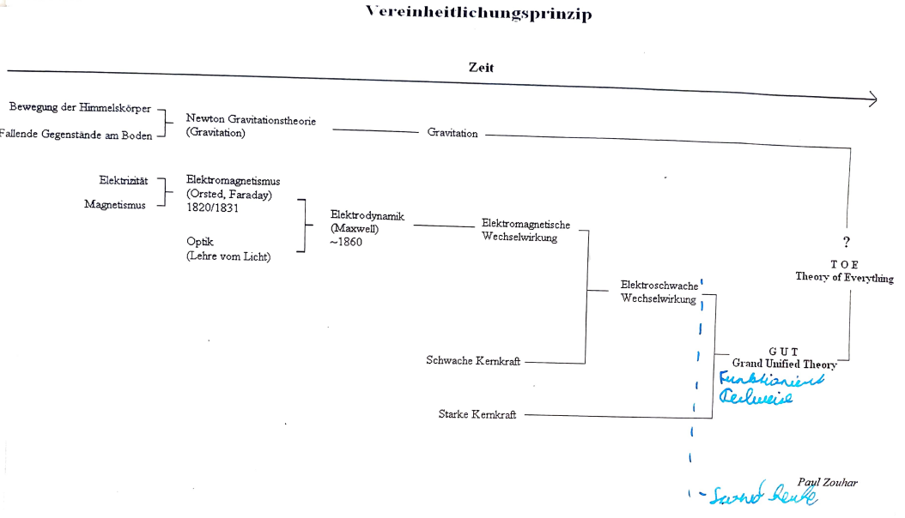

## 1.3.1 Quantentheorie und die allgemeine Relativitätstheorie

| Quantentheorie | Allgemeine Relativitätstheorie |
| --- | --- |
| Von Bohr, Einstein, Dirac geschaffen, beschreibt alles, was existiert außer die Gravitation | Von Einstein geschaffen, beschäftigt sich mit der Gravitation |

Bis heute sind diese nicht vereinbar.  

## 1.3.2 Vereinheitlichungsprinzip

Das Hauptziel der Physik besteht darin alle Phänomene durch eine Grundlegende Theorie zu beschreiben.  

## 1.3.3 Technische Bemerkungen zur modernen Physik

- Größenordnungen: Verschiedene Zehnerpotenzen haben unterschiedliche Vorsilben. (Siehe Basiswissen 5 Seiten 6 und 7)
- SI-Einheiten: Maßeinheiten, die in der Physik für zb. Berechnungen benutzt werden müssen.
Die SI-Einheit der Temperatur ist Kelvin und nicht Celsius, da Kelvin physikalisch mehr Sinn ergibt. Außerdem gilt es zwischen Wärme und Temperatur zu unterscheiden. Wärme ist ein Maß für die Gesamtenergie, wohingegen Temperatur ein Maß für die Geschwindigkeit von ungeordneten Teilchen ist.  

