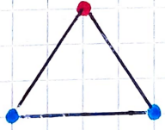
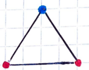

Das Standartmodell ist stand heute richtig, allerdings nicht vollständig. Es ist unvollständig, da es gleich viele Quarks und Leptonen gibt, was nicht unbedingt warscheinlich ist, da es sich hier um zwei komplett verschiedene Arten von Teilchen handelt.  

| Leptos (gr.)=leicht Leptonen=leichte Teilchen | Quarks=3 Dinge, die gemeinsam stark sind |
| --- | --- |

Es gibt insgesamt 6 bekannte Quarks. Das Up und Down Quark sind die leichtesten und für unsere Existenz die wichtigsten, da sie Neutronen und Protonen bilden. Die Ladung des Up-Quark ist $+\frac{2}{3}$ und die des Down-Quark $-\frac{1}{3}$.  

## 2.1.1 Quark-Aufbau von Protonen und Neutronen

**Neutron**: Ladung=Neutral: $\left(-\frac{1}{3}\right)+\left(-\frac{1}{3}\right)+\frac{2}{3}=0$  

**Proton**: Ladung=Positiv: $\frac{2}{3}+\frac{2}{3}+\left(-\frac{1}{3}\right)= +1$  

Die Quarks werden durch die Starke Kraft zusammengehalten.  

Umso mehr Masse ein Teilchen hat, desto instabiler, also desto kurzlebiger ist es.  

## 2.1.2 Leptonen

Es gibt insgesamt 6 Leptonen: Drei Neutrinos, das Elektron und das Myon, sowie das Tau.  

Neutrinos sind extrem leichte, elektrisch neutral geladene Teilchen, deren genaue Masse wir nicht kennen, da diese so klein ist. Myon und Tau sind schwerere Elektronen und deswegen auch sehr kurzlebig.  

## 2.1.3 Antimaterie

Antimaterie besteht aus Antiteilchen, diese werden von Dirac theoretisch entdeckt und 1930 von Anderson nachgewiesen. Antiteilchen und Teilchen unterscheiden sich nur in ihrer Ladung, die immer gegenteilig ist. Heute kann man bereits Anti-Wasserstoff und Helium herstellen.  

**Annihilation/Paarvernichtung**  

Die Formel $E=m\cdot c^{2}$ sagt uns, dass es möglich ist aus Masse Energie herzustellen und umgekehrt. Dieses Prinzip wird unter anderem bei Kernspaltung und Kernfusion angewandt. Auch wenn Antimaterie auf Materie trifft, wird Energie frei. Die gesamte Masse der aufeinandertreffenden Materie wird zu 100% in Energie umgewandelt. Zum Vergleich: Bei der Spaltung von Uran-235 in Kernkraftwerken wird nur 0.1 Prozent der Masse in Energie umgewandelt.  

### Beispiel: $e^{-}+e^{+}→γ+γ$

