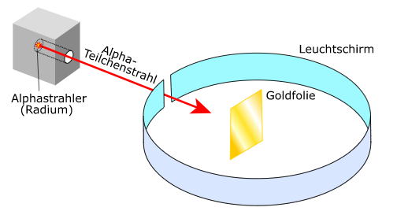

**Die Ordnungszahl** steht für die Anzahl an Protonen im Kern, das Kürzel steht für den Elementnamen. Das System ordnet alle Elemente nach ihrer Ordnungszahl mit dem Symbol Z. bei einem neutralen Atom gibt die Ordnungszahl auch die Anzahl der Elektronen an.  

**Die Neutronenzahl** (N) gibt die Anzahl der Neutronen im Kern an. Diese ist selten gleich der Ordnungszahl!  

**Die Nukleonenzahl** (A) addiert Ordnungs- und Neutronenzahl. Nukleon = Protonen und Neutronen.  

## 3.2.1 Isotope

Jedes Element hat verschiedene Isotope, die sich durch ihre Neutronenzahl unterscheiden. Sie haben aber immer die gleiche Ordnungszahl, da es sich sonst um ein anderes Element handeln würde. Chemisch unterscheiden sich Isotope kaum voneinander, da es hier hauptsächlich auf die Anzahl von Protonen und Elektronen ankommt. Jedoch kann eine zu niedrige oder zu hohe Neutronenzahl dazu führen, dass das Isotop radioaktiv ist.  

## 3.2.2 Das Experiment von Rutherford

Zur Zeit von Rutherford war nicht bekannt, wie Atome aufgebaut sind. Man nahm an, dass sich die negative Ladung auf kleine Punkte konzentrierte und sich um diese herum die positive Ladung befand. Rutherford widerlegte diese Annahme mit einem Experiment:  

Er beschoss eine dünne Goldfolie mit Alpha-Strahlung, die positiv geladen ist. Einige der Alpha Teilchen wurden zurückgestreut, woraufhin Rutherford zum Schluss kam, dass der Kern positiv geladen ist.  

