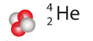

Radioaktivität ist fast ausschließlich ein Phänomen des Atomkerns. In der Regel haben radioaktive Isotope zu viel Energie, was den Kern instabil macht. Dadurch zerfällt er irgendwann, unabhängig von äußerem Einfluss, zu einem anderen Kern. Das kann sich so oft wiederholen, bis er zu einem stabilen Isotop zerfallen ist. Bei diesen Zerfällen wird ionisierende Strahlung emittiert. Insgesamt gibt es vier Gründe, warum ein Kern radioaktiv ist:  

**Zu viel Masse**: Im Kern sind zu viele Protonen und Neutronen. Diese Isotope sind auf der Nuklidkarte gelb.  

**Zu viele Neutronen:** Auf der Nuklidkarte blau.  

**Zu viele Protonen:** Auf der Nuklidkarte rot.  

**Zu viel Energie: **Auf der Nuklidkarte weiß.  

## 3.3.1 Die drei wichtigsten ionisierenden Strahlungen

**Die Alpha-Strahlung** besteht aus einem Heliumkern und ist zweifach positiv geladen. Diese heliumkerne (oder $α$-Teilchen) werden mit hoher Geschwindigkeit aus dem Atomkern abgefeuert. Alphastrahler sind zu schwer, um stabil zu sein. Im Zuge des Zerfalls sinkt Z um 2 und A um 4. Der Kern bildet also ein anderes Element.  

**Die Beta-Minus-Strahlung** besteht aus Elektronen. Zunächst zerfällt im Kern ein Neutron zu einem Proton, einem Elektron und einem Antineutrino, was beta-Minus-Zerfall genannt wird: $n-→p^{+}+e^{-}+V_{e}$. Das Elektron verlässt den Kern und wird Beta-Minus-Strahlung genannt, das Antineutrino annihiliert und das Proton bleibt im Kern, wodurch das sich das Element umwandelt. Allgemein folgen Radioaktive Zerfälle gewissen Regeln. Eine davon ist, dass Ursprungsteilchen und die neu entstandenen insgesamt die gleiche Ladung haben. Um genau zu sein wandelt sich hier ein Down Quark (-1/3) des Neutrons in ein Up Quark (+2/3) um, wodurch sich das Neutron in ein Proton (+1) verwandelt. Dieses ist klarerweise positiv geladen. Um der vorher erwähnten Regel zu entsprechen, entsteht das Antineutrino, da sich das Down Quark mithilfe der schwachen Kraft umwandelt. Dabei wird ein W-Minus Boson ausgestrahlt, was nach kurzer Zeit zu Antineutrino und Elektron zerfällt. Beta-Minus Strahler haben zu viele Neutronen.  

**Die Beta-Plus-Strahlung** besteht aus Positronen, also dem Antiteilchen des Elektrons. Im Zuge des Beta-Plus-Zerfalls zerfällt ein Proton zu einem Neutron, einem Positron und einem Neutrino: $p^{+}-→n+e^{+}+V_{e}$. Das Neutron bleibt im Kern, Positron und Neutrino werden ausgestrahlt. Durch den Zerfall sinkt die Ordnungszahl um 1, die Nukleonenzahl bleibt konstant. Im Detail wird ein Up Quark zu einem Down Quark. Dadurch wandelt sich das Proton zum Neutron. Erneut spielt die schwache Kraft eine wichtige Rolle; diesmal wird ein W-Plus-Boson emittiert, welches in Positron und Neutrino zerfällt.  

**Die Gammastrahlung** besteht aus hochenergetischer elektromagnetischer Strahlung. Dieser passiert, wenn der Kern zu viel Energie hat. Hier ändert sich weder Ordnungs- noch Nukleonenzahl.  

## 3.3.2 Das Geiger-Müller Zählrohr

Radioaktivität verursacht Ionisierung, die freien Elektronen bilden einen Stromfluss, der gemessen wird. Somit wird indirekt die Intensität der Radioaktiven Strahlung gemessen.  

## 3.3.3 Strahlenschutz

Es ist sehr wichtig sich vor Strahlung zu schützen, da diese Schäden in der DNA verursacht und so Krebs verursacht. Zellen, die sich oft teilen sind besonders anfällig für Mutationen. Die wichtigsten Schutzmaßnahmen sind: Die Aufenthaltszeit so niedrig wie möglich halten, den Abstand zum Objekt so groß wie möglich halten und Abschirmung durch zum Beispiel Blei, Bleiglas oder Stahlbeton.  

Die Dosis der Strahlung nimmt quadratisch ab, wenn der Abstand zur Quelle vergrößert wird. Die Oberfläche der Kugel ist hierbei entscheidend, da die Oberfläche quadratisch zunimmt, je größer der Radius der Kugel ist.  

Die für dieses Thema entscheidende Proportionalität ist jene, die für ziemlich kleine bzw. punktförmige Strahlungsquellen und Schallquellen gilt: $I_{s}∝\frac{1}{r^{2}}$  

(I= Intensität der Strahlung; r=Abstand zwischen Beobachter und Quelle)  

Wenn r größer wird, wird die Intensität viel schwächer.  

Wen r kleiner wird, wird die Intensität um vieles stärker.  

Gilt nur, wenn die Quelle punktförmig ist!  

## 3.3.4 Die Halbwertszeit

Unter der Halbwertszeit $T\cdot \frac{1}{2}$ eines radioaktiven Stoffes, versteht man jene Zeitspanne, nach der die Hälfte aller instabilen Atomkerne dieses Stoffes zerfallen ist. Je instabiler ein Radioisotop ist, umso kürzer ist dessen Halbwertszeit. Die Halbwertszeit ist ein statistischer Begriff: Die Halbwertszeit und die sogenannte Zerfallskurve können nur dann sinnvoll verwendet werden, wenn man eine sehr große Anzahl von radioaktiven Atomen berechnen möchte (In der Fachsprache: Wenn ein großes Ensemble radioaktiver Atome vorliegt). Genau betrachtet sieht die Zerfallskurve aus wie auf der Kopie (abrupte Abfälle und keine konstante Senkung der Anzahl der Atome).  

## 3.3.5 Die Zerfallskurve:

$N_{0}$=Ausgangsmenge des radioaktiven Stoffes  

N(t)= Die Menge des radioaktiven Stoffes, die zum Zeitpunkt t noch vorhanden ist  

$$
N_{0}=N\left(t=0\right)
$$

Es gibt einen Grund dafür, warum ein radioaktives Atom zerfällt (zb. Zu viel Energie), es gibt jedoch keinen Grund für den Zeitpunkt des Zerfalles. Ein radioaktives Element zerfällt komplett zufällig. Für dieses Verhalten wird auch der Begriff Quantenzufall verendet. Dies ist keine Angelegenheit des menschlichen Noch-nicht-wissens, sondern ein Ausdruck der Verfasstheit unseres Universums. Metaphorisch formuliert könnte man sagen, dass die Natur selbst nicht weiß, wann ein Atom zerfällt.  

## 3.3.6 Formeln zum radioaktiven Zerfall

$$
N\left(t\right)=N_{0}\cdot 2^{-\left(\frac{t}{T}\right)}\left(\frac{1}{2}\right)
$$

$$
N(t)=N_{0}\cdot e^{-tλ}
$$

$$
λ=\frac{ln(2)}{T(0,5)}
$$

**Beispiel**: In der Hirnforschung wird bei einem bildgebenden Verfahren O-15 verwendet. Durch eine Lieferverzögerung wird dieses Radioisotop erst 13 Minuten später geliefert. Zeige durch eine Rechnung, warum sich der Forschungsleiter aufregt.  

$λ=\frac{ln(2)}{T(0,5)}$= $\frac{ln(2)}{2,03}$= 0,3415  

N(13)=$100\cdot e^{-13\cdot 0,3415}$= 1,18%  

**2)A3)c)**  

T(0,5)=30,2 Jahre   $λ$=0,02295  

N(36)=$100\cdot e^{-30,2\cdot 0,02295}≈43,77\%$  

3) Während eines AKW-Unfalls werden große Mengen an Iod-131 freigesetzt. Argumentiere das Ausmaß der Gefährdung nach 40 Tagen.  

$$
λ=\frac{ln\left(2\right)}{8}≈0,0866
$$

N(40)=$100\cdot e^{-40\times 0,0866}≈$3,13%  

Je nachdem wieviel freigesetzt wurde können 3,13% vom Anfangswert noch immer sehr viel bzw. eine große Gefahr sein, oder, wenn die Anfangsmenge relativ klein war, ein geringes Risiko für den Menschen darstellen.  

## 3.3.7 Kosmische Strahlung

1912 war Radioaktivität noch ein recht neues Phänomen. Ionisierende Strahlung kommt aus dem Boden war die Annahme. Hess wollte nach oben fliegen und mit einem Messgerät nachweisen, dass die Strahlung, je weiter man oben ist, abnimmt, sie nahm jedoch mit zunehmender Höhe immer weiter zu. So kam er zu dem Schluss, dass Strahlung auch aus dem Weltall kommt. Gründe für kosmische Strahlung sind: Supernovae, Neutronensterne und schwarze Löcher. Je weiter oben wir uns befinden, desto weniger wird von der Erdatmosphäre abgelenkt.  

**Quellen**: Neutronensterne, schwarze Löcher, sehr heiße Sterne, Supernovae  

**Schutzmöglichkeiten**: Gefrorenes Wasser, Magnetschild, Quartiere unter Marsboden  

Die kosmischen Strahlen werden in 2 Gruppen bzw. in 2 Untergruppen eingeteilt:  

1) Einteilung hinsichtlich der Quelle der Strahlung:  

a)  Solare kosmische Strahlung kommt von der Sonne, besteht hauptsächlich aus hochenergetischen, also schnellen Protonen und besteht aus α Teilchen.  

b)  Interstellare Strahlung kommt aus den Tiefen des Alls. (siehe oben)  

2) Einteilung hinsichtlich der Wechselwirkung der Teilchen mit Luftmolekülen:  

a)  Primäre Strahlung (1a und 1b)  

b)  Sekundäre Strahlung entsteht durch die Kollision der Primärstrahlung mit Luftmolekülen (N2 und O2), wie auf den Kopien dargestellt. Circa 75% der Sekundärstrahlung besteht aus Myonen und Antimyonen.  

## 3.3.8 Exkurs Spezielle Relativitätstheorie (1905 von Albert Einstein entwickelt)

τ= durchschnittliche Lebensdauer instabiler Teilchen  

τ μ-=$2,2\cdot 10$-6s  

Die Geschwindigkeit der Myonen ist fast gleich schnell wie Licht. $C_{0}=3\cdot 10^{8}m/s$  

Primärteilchen zerfallen in einer Höhe von 20 km Höhe zu Myonen.  

Das Problem ist, dass eigentlich kein Myon ankommen könnte, da sie nicht schnell genug sind, um anzukommen, bevor ihre Lebensdauer vorbei ist. Allerdings kann man auf der Erde noch immer Myonen messen. Im Rahmen der SRT gibt es zwei Effekte, mit denen der Umstand erklärt werden kann, dass Myonen in großer Zahl den Erdboden erreichen können, obwohl das im Rahmen der klassischen Physik nicht möglich ist: Diese Effekte sind die sogenannte Zeitdilatation und die Längenkontraktion. Diese beiden Effekte sind Konsequenzen, die sich aus den Grundlagen, die sich aus den Grundlagen der SRT ergeben. Die Zeitdilatation sagt, dass die Zeit in einem System, dass sich relativ zu uns sehr schnell bewegt, langsamer vergeht. Myonen sind sehr schnell und profitieren so von diesem Konzept.  

$$
t_{b}=t_{r}\cdot \sqrt{1-\frac{v^{2}}{c^{2}}}
$$

Wegen des Quadrats über v ist klar, dass sich die Funktion quadratisch bewegt und je näher man sich c annähert, desto steiler steigt der Graph an. Für ein Photon oder ein anderes lichtschnelles Teilchen vergeht also keine Zeit, was für den menschlichen Verstand eigentlich nicht vorstellbar ist.  

Die Längenkontraktion besagt, dass der Weg kleiner ist, je schneller man sich bewegt. Jeder, der von der Zeitdilatation beeinflusst wird, merkt diese Person das nicht. Aus der Sicht der Person hat sich der Weg verkürzt. Die gleiche Formel gilt auch für die Längenkontraktion und die relative Massenzunahme.  

## 3.3.9 Positronenemissionstomographie (PET)

Positronen werden emittiert. Tomos= Schnitt  

Ist wichtig für die Medizin. Gute und genaue Aufnahmen der Gehirnaktivitäten.  

$Β$+ Strahler sind die Grundlage, zum Beispiel O-15, dessen Halbwertszeit ungefähr 2,5 Minuten beträgt. Beim Β+ Zerfall entstehen Positronen. Diese annihilieren mit einem Elektron. Die Energie, die bei diesem Vorgang entsteht, wird gemessen. Man braucht mindestens 4 Gammaquanten bzw. 2 Annihilationen für einen Schnittpunkt.  

