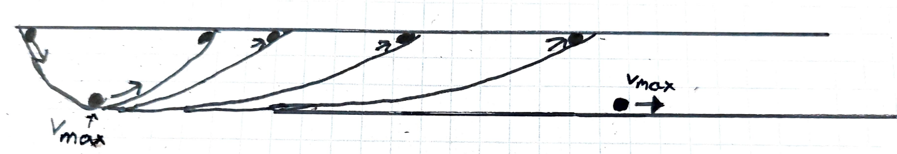

Im Mittelalter war die Scholastik die anerkannte Wissenschaft. Aristoteles war der Ursprung dieser Wissenschaft. Diese kam sehr gut bei der Kirche an. In der Renaissance wurde das Weltbild der Kirche immer weiter in Frage gestellt und auch die Wissenschaft entwickelte sich weiter. Galileo Galilei war federführend.  

## 4.1.1 Streit um das Nichts

Dieser Streit handelt von dem sogenannten Vakuum, also dem leeren Raum.  

Um 500 v. Chr. gab es die Atomisten, Verfechter der Denkweisen von Demokrit. Sie sagen: Welt = Atome + leerer Raum. Die Atomisten haben ein Weltbild, in dem kein Platz für Gott ist.  

Es gibt zwei fundamental verschiedene Denkweisen:  

1: Der Materialismus, wozu auch der Atomismus gehört. Er baut nur auf gleichen Teilen (Atomen) auf. Laut dem Atomismus ist die Seele also angreifbar und besteht aus Atomen. Diese Denkweise ist der Kirche sehr unsympathisch, da sie ein Leben nach dem Tod ausschließt.  

2: Der Idealismus, welcher nicht nur auf Atome, sondern auch auf Geist und Seele aufbaut, die Welt besteht also nicht nur aus Atomen, sondern zb. im Platonismus auch aus Ideen. Im Idealismus ist der Geist viel wichtiger als die Materie.  

**Epikur**  

Lebte um ca. 350 v. Chr.  

Sagte, dass man sich nicht vor dem Tod fürchten muss, da man, wenn man tot ist, nichts wahrnimmt, genauso, wie man vor seiner Geburt nichts mitbekommt. Er vergleicht den Tod mit dem Prozess des Einschlafens, den man auch nicht war nehmen kann, mit dem Sterben.  

Eine weitere Furcht, mit der er sich beschäftigte, war die Angst vor Göttern. Er sagt, dass Menschen den Göttern egal sind und nicht von ihnen bestraft werden. Es gibt sie zwar, aber sie kümmern sich nicht um uns.  

Wenn man sich den Atomismus anschaut, wird man merken, dass Atomismus und Atheismus sehr nahe aneinander liegen.  

**Aristoteles**  

Laut ihm existiert der Horror vacui, die Angst der Natur vor leeren Räumen, es gibt also kein Vakuum. Er war bei der Kirche sehr beliebt, da seine Thesen Parallelen mit der Kirche aufzeigten. Diese Theorien wurden bis zum Ende des Mittelalters als richtig erachtet. In der Renaissance wurden die Atomisten wieder relevanter.  

**Galilei**  

Ist ein Atomist. 12 Jahre nach seinem Tod wurde bewiesen, dass das Vakuum existiert. Dies wurde mithilfe von Vakuumpumpen erreicht.  

## 4.1.2 Wie fallen Gegenstände zu Boden?

**Scholastiker**: je schwerer ein Gegenstand ist, desto schneller fliegt er zu Boden. Diese These ist falsch. Alles fällt gleich schnell. Ein Blatt Papier fällt nur deswegen langsamer als eine Metallkugel, da der Luftwiederstand des Blatt Papiers viel größer ist. Alles fällt gleich schnell, da die Trägheit äquivalent zum Gewicht eines Körpers ist. Das heißt: Je schwerer ein Körper, desto mehr Kraft muss aufgewendet werden, um ihn zu bewegen.  

Galilei machte ein Gedankenexperiment (einen sogenannten Widerspruchsbeweis), um zu zeigen, dass Aristoteles einen Widerspruch in seinem Denken hat.  

Es gibt drei Körper: Einen schweren, einen um vieles leichteren. Laut Aristoteles ist der erste Körper schneller unten, wenn man beide fallen lässt. Der dritte Körper ist aus den anderen beiden aufgebaut. Laut seinen Thesen würde Körper B Körper A aufhalten und somit würde Köper C langsamer fallen als Körper A. Er sagt allerdings auch: Je schwerer ein Körper ist, desto schneller fällt er. Hier sieht man einen fundamentalen Wiederspruch.  

Galilei kommt zum Schluss, dass alle Körper im Vakuum gleich schnell fallen.  

Wenn Voraussetzungen gegeben sind, können aus ihnen gewisse Schlüsse gezogen werden, andere nicht.  

**Frage**: Wie fallen Gegenstände zu Boden? An dieser Frage hängt eine weitere: Wie fallen Körper im Vakuum? Diese kann nur Galilei beantworten, da die Scholastiker nicht an das Vakuum glauben.  

## 4.1.3 Hören einmal bewegte Körper von selbst auf sich zu bewegen?

**Impetus-Theorie**: Impetus=innerer Antrieb  

Aristoteles sagt, dass eine Kugel von selbst stehenbleibt. Laut ihm geben wir einer Kugel einen Impetus, wenn wir sie bewegen und wenn die Kugel stehengeblieben ist, sagt Aristoteles, dass der Impetus aufgebraucht ist. Allerdings bewegen sich die Himmelskörper unendlich lang. Seine Theorie ist nur auf der Erde wirksam. Er hat wieder nicht Recht und es steht 3:0 für Galilei, da er erneut ein Gedankenexperiment gemacht hat: Es gibt eine Halfpipe im Vakuum. Diese Halfpipe hat keine Reibung (was in der Praxis nicht möglich ist). Die Kugel bewegt sich also unendlich lang hin und her. Laut Aristoteles müsste der Impetus unendlich groß sein, damit so etwas möglich ist. Im Gedankenexperiment wird aber nur wenig Kraft verwendet und deswegen steht es jetzt **3:0** für Galilei.  

## 4.1.4 Relativität der Bewegung

Man dachte lange, dass man Objekte aus einem absoluten Standpunkt, der nicht relativ ist, beobachten kann. Das ist falsch. Ein Objekt kann sich relativ zu mir bewegen, relativ zu einem anderen bewegt es sich nicht. Beispiel: Der Laptop, auf dem ich gerade schreibe, bewegt sich relativ zu mir nicht, bewegt sich aber relativ zur Sonne sogar sehr schnell. Vor allem bei Geschwindigkeiten sollte immer eine Relativität angegeben werden.  

Die Relativität der Bewegung bedeutet, dass jede gleichförmige, das heißt nicht beschleunigte Bewegung, immer relativ ist, das bedeutet von einem Beobachter abhängig ist: wenn man etwas über den Bewegungszustand eines Körpers aussagt, muss man immer die Position des Beobachters mitbedenken, von der aus die Bewegung betrachtet wird. Das hat eine wichtige Konsequenz: Zwischen dem Zustand der unbeschleunigten Bewegung und dem Zustand der Ruhe gibt es keinen physikalischen Unterschied! Es kann durch kein einziges physikalisches Experiment unterschieden werden, ob er sich bewegt oder ruht.  

Daraus ergibt sich der Weltbildstreit. Aristoteles und die Scholastiker vertreten das geozentrische Weltbild, Kopernikus und Galilei das Heliozentrische.  

**Turmargument**  

Jemand wird von einem Turm mit einem Stein abgeworfen, weil er Leuten auf die Nerven geht.  

| Scholastiker | Galilei |
| --- | --- |
| Sagen, dass die Erde ruht und der Stein fällt direkt gerade nach unten. Wenn sich die Erde bewegen würde, würde sich auch der Turm bewegen und nach deren Meinung würde der Turm den Stein einholen, während er fällt, und so würde der Stein hinter dem Turm landen. | Sagt, dass sich der Turm mit der Erde mitbewegt. Allerdings auch der Stein und alles, was auf der Erde existiert. Von der Erde aus gesehen fällt er senkrecht nach unten. Von der Sonne aus gesehen wird er nach vorne geworfen und von der Erde eingeholt. |

