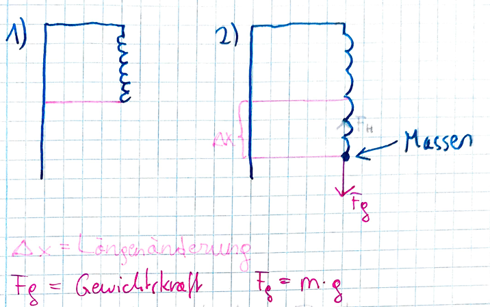
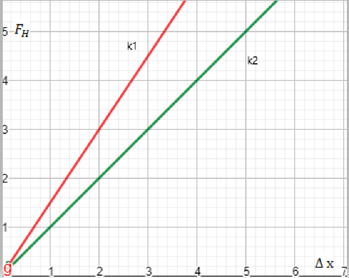

## 4.4.1 Masse und Dichte

**Symbol**: Masse=m Dichte=ρ  

**Einheit**: Masse=kg Dichte=$\frac{kg}{m^{3}}$  

Formel für Dichte ρ: $ρ=\frac{m}{v}$  $Dichte=\frac{Masse}{Volumen}$  

Die Masse ist eine physikalische Grundgröße, die allen Körper bzw. Teilchen mit Masse besitzen (und über die Formel$e=m\cdot c^{2}$ auch dem Licht) zuzuschreiben ist. Masse wird durch 2 wesentliche Merkmale bzw. Bestimmungsgrößen definiert:  

a) Trägheit/träge Masse mt : Beschreibt die Eigenschaft von Massen, sich einer Beschleunigung zu widersetzen.  

b) Schwere/schwere Masse ms: Bezeichnet die grundlegenden Eigenschaften von Massen einander durch die Gravitation anzuziehen.  

Es gilt folgende starke Beziehung: ms=mt. Das heißt Schweremasse ist zahlenmäßig exakt gleichgroß die die Trägemasse!  

**Bsp**: Freier Fall ohne Luftreibung  

Man lässt einen lichten und einen schweren Körper aus gleicher Höhe fallen. Beide fallen gleichschnell, da der schwere Körper zwar mehr angezogen wird, seine Trägheit aber auch höher ist. Trägheit und Gravitation gleichen sich aus.  

## 4.4.2 Die drei Newton’schen Axiome

**Axiom**: Ist ein Grundsatz. Axiome sind die Basis von Theorien. Man kann eine Theorie mit Axiomen herleiten und umgekehrt. Es ist allerdings unmöglich ein Axiom herzuleiten. Wenn man es herleiten kann, ist es kein Axiom mehr. Es ist auf Intuition aufgebaut.  

**1. Axiom**  

**Ein Körper, auf den keine Kraft wirkt, verharrt im Zustand der Ruhe oder der gleichförmig geradlinigen Bewegung. Dieses Axiom wird als Trägheitssatz bezeichnet.**

Ein Inertialsystem ist ein Bezugssystem, in dem der Trägheitssatz, dh. das erste Axiom von Newton, gilt. Ein Inertialsystem ist ein unbeschleunigtes Bezugsystem, dh. ein System, auf das keine resultierende Kräfte wirken.  

Der Begriff des Inertialsystems ist eine Idealisierung, es gibt kein ideales Inertialsystem, weil zb die Schwerkraft unendliche Reichweite hat und überall wirkt. Es gibt aber gute Annäherungen, wie zb ein Raumschiff weit weg von Planeten und Sternen ohne Antrieb. Ein weiteres Beispiel: Ein Zug fährt mit 100 km/h in gerader Richtung.  

Alle Inertialsysteme sind gleichberechtigt!!  

Das Foucault’sche Pendel: Die Schwingungsebene stellt ein Inertialsystem dar, da sie ihre Lage im Raum beibehält, während sich die Erde unter der Schwingungsebene um ihre eigene Achse dreht. Das Pendel ist kein Inertialsystem, da es durch seine Schwingung immer wieder beschleunigt wird.  

**2. Axiom/Kraftgesetz**  

**Kraft (F), Masse (m) und Beschleunigung (a) sind sehr eng miteinander verbunden und bauen aufeinander auf.**

$$
F=m\cdot a
$$

Beschleunigung ist, wenn Kraft auf Masse wirkt. Die Kraft ist also die Ursache jeder Beschleunigung, das heißt: Ohne Kraft gibt es keine Beschleunigung.  

Erörterung des zweiten Axioms in 3 Fällen:  

Wir lassen jeweils eine Größe konstant und beobachten wie sich die anderen zwei zueinander verhalten am Beispiel eines Modellzuges, der per Hand gezogen wird.  

a) Wenn F=konstant und wird m größer nimmt a ab bzw. wird m kleiner nimmt a zu.  

b) Wenn m=konstant und wird a größer nimmt F zu bzw. wird a kleiner nimmt F ab.  

c) Wenn a=konstant und wird m größer nimmt F zu bzw. wird m kleiner nimmt F ab.  

**3. Axiom**  

(Actio est reactio)  

**Stehen zwei Körper in Wechselwirkung miteinander, so haben die auf sie wirkende Kräfte die gleiche Größe, aber die entgegengesetzte Richtung. Kräfte treten immer paarwiese auf.**

$$
F_{1}=-F_{2}
$$

**Wechselwirkung**: Teilchen  

Beispiele für die Wechselwirkung:  

Man springt vom Boden weg. Es wirkt Kraft auf dich und du fliegst in die Luft. Die gleiche Kraft wirkt auch auf die Erde, allerdings in die entgegengesetzte Richtung, heißt du stößt die Erde von dir weg. Da die Erde allerdings eine sehr hohe Masse hat, richtet diese Kraft kaum etwas aus.  

Alltagsbeispiele für das dritte Axiom (siehe Kopie und Buch, Seite 38)  

Wenn man von einem Boot springt, dass das gleiche Gewicht hat wie man selbst, wird es sich mit der gleichen Geschwindigkeit in die Entgegengesetzte Richtung bewegen.  

## 4.4.3 Beispiel für eine spezielle Kraft: Die Hook’sche Kraft

**Symbol**: $F_{H}=Hook^{'}sche Kraft=Federkraft=rücktreibende Kraft$  

Die Hook’sche Kraft wird durch das Hook’sche Gesetz beschrieben, die Längenänderung (Ausdehnung oder Stauchung) einer Feder oder eines Elastischen Körpers ist direkt proportional zu der Kraft, die die Längenänderung verursacht (zum Beispiel Gewichtskraft oder Muskelkraft).  

$F_{H} = -k \cdot  Δ x$         $F_{H}= k \cdot  Δ x$  

K=Federkonstante=Maß für Stärke der Feder. Je größer k, desto stärker die Feder.  

$Δ x=Längenänderung$  

==Experiment mit Gewichten==  

Im Kräftegleichgewicht gilt: $F_{H}=-F_{g}$  

$$
k \cdot  Δ x=m\cdot g
$$

$$
k=\frac{m\cdot g}{Δ x}
$$

**Rechenbeispiel**: An eine Feder wird eine Masse von 250 Gramm gehängt. Die Feder dehnt sich dadurch um einen Zentimeter. Wie groß ist die Federkonstante k?  

K=245,25 N/m  
Graphische Darstellung  

==Spannungsarbeit==  

$$
w_{H}=\frac{kx^{2}}{2}
$$

