

## 5.1.1 Antike (500 v. Chr.)

Die Fragen der antiken Philosophen sind wichtig für uns, nicht ihre Antworten. Diese sind oft falsch.  

Man fand magnetische Steine in der heutigen Türkei (Magnesia) und hat sich gefragt, warum sie andere Dinge anziehen.  

Es gab auch schon Bernstein, dessen griechisches Wort Elektron heißt. Wenn man Bernstein an Fell reibt, entsteht Ladung. Cool, oder?  

Bernstein und Magnetsteine beschreiben zwei Phänomene – Magnetismus und Elektrizität.  

Damals kannte man den Elektromagnetismus noch nicht.  

## 5.1.2 Neuzeit (1650)

Die Influenzmaschine wurde erfunden - die erste Möglichkeit Strom zu erzeugen und somit die Voraussetzung für Experimente mit elektrischem Strom. Allerdings liefert diese Maschine nicht konstant Strom, sondern nur blitzartig.  

Diese Quelle war nicht zuverlässig und haltbar, zu der Zeit war sie jedoch die einzige Möglichkeit. Eine Übersicht über den Fortschritt im Laufe der Zeit:  

**Franklin (1706-1790) **  

Erfindet den Blitzableiter  

**Galvani (1780)**  

Beobachtete, wie aufgehängte Froschschenkel zuckten und entdeckte so die Möglichkeit, eine Batterie zu bauen. (Zwei Metalle und Elektrolyt)  

**Volta**  

Baut die erste Batterie. Somit hatte man erstmals eine zuverlässige, gleichmäßige und lang haltbare Stromquelle.  

**Romantik/Ørsted (1820)**  

Die Romantik sagt, dass alles auf einer tieferliegenden zusammenhängt. Dieser Gedanke stammt aus der Antike und lebt in dieser Zeit wieder auf. So kam man auf die Idee, das Elektrizität und Magnetismus zusammenhängen. Er setzt eine Kompassnadel unter Strom. Da elektrischer Strom ein Magnetfeld verursacht, bewegt sich die Nadel. So wurde der Zusammenhang entdeckt.  

**Faraday (1831)**  

**Gedanke**: wenn Elektrizität Magnetismus verursacht, müsste es umgekehrt auch so sein. Faraday entdeckt die elektromagnetische Induktion: Ein veränderliches Magnetfeld erzeugt elektrische Spannung und in weiterer Folge elektrischen Strom. Das ist das angewandte Prinzip elektrischer Energie im Generator.  

**Maxwell (1856)**  

Maxwell stellt sich die Frage, was mit den Feldlinien passiert, wenn eine Ladung oder ein Magnetpol bewegt bzw. ausgelenkt werden. Diese Auslenkung breitet sich  mit Lichtgeschwindigkeit Wellenförmig aus. Die Schlussfolgerung ist, dass Licht eine Elektromagnetische Welle ist. Auf diese Art und Weise wurde der Elektromagnetismus und die Optik vereinigt.  

**Hertz (1888)**  

Hertz kann erstmals Mikrowellen erzeugen und kann Elektromagnetische Wellen so nachweisen.  

**Macroni (1900)**  

Ist der erste Mensch, der mithilfe von Elektromagnetischen Wellen über den Atlantik Funkkontakt zwischen Europa und Amerika herstellt. Das Medium waren Kabel am Meeresgrund.  

**Heute-QED (Quantenelektrodynamik)**  

-Erklärt die Wechselwirkung zwischen Elektronen und Photonen.

## 5.1.3 Die elektrische Ladung (Buch 6, Seite 87-88)

**Symbol**: Q  

**Einheit**: Coulomb/C  

Die elektrische Ladung ist eine sogenannte Quantenzahl, Quantenzahlen dienen allgemein zur Beschreibung des Verhaltens von Elementarteilchen und stellen eine wesentliche Eigenschaft dieser Teilchen dar. (Ein anderes Beispiel für eine Quantenzahl ist der Spin).  

**Beispiel**: Experiment zur Untersuchung der Ladung von unbekannten Teilchen.  

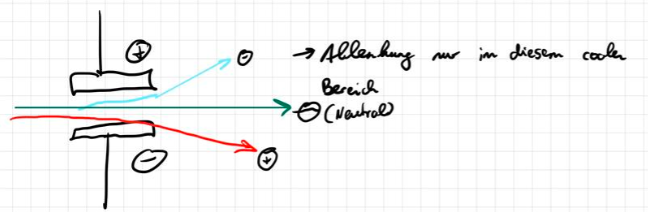

Die elektrische Ladung  eines Körpers (zb. Hartgummistab und Fell) wird durch Elektronenmangel (positiv geladen) bzw. Elektronenüberschuss (negativ geladen) bestimmt. Ein neutraler Körper besitzt genauso viele Protonen im Atomkern, wie Elektronen in der Atomhülle oder zwischen den Atomen  (dies ist bei Metallen der Fall).  

Die elektrische Ladung ist quantisiert (das heißt portioniert bzw. diskret), sie tritt ==messbar== nur in ganzzahligen Vielfachen der Elementarladung auf. Die elektrische Ladung eines beliebigen Körpers (Wollpullover) Q wird mit folgender Formel berechnet:  

$$
Q=n\cdot e
$$

Q=Ladung eines Körpers, n = ganze Zahl, e = Elementarladung.  

Definition der Elementarladung: Die Elementarladung e ist die kleinste ==direkt== messbare Ladung.     $e=1,6\cdot 10^{-19}$ C. Der Zusatz direkt ist wegen der Drittelladung der Quarks nötig, die man ja direkt nicht messen kann, da es nicht möglich ist, sie voneinander zu isolieren.  

**Beispiel**: Ein Elektron und ein Proton besitzen zwar unterschiedlich Ladungen, beide haben jedoch exakt den gleichen Ladungsbetrag, nämlich die Elementarladung e.  

**Erhaltungssatz der elektrischen Ladung: **  

In einem abgeschlossenen System bleibt die ==Summe== der elektrischen Ladungen stets gleich.  

Zb. β- Zerfall  

$n-→p^{+}+e^{-}+V_{e}-→$ Elektrische Ladung ist noch immer Null.  

Das Wort Summe in der Formulierung des Ladungserhaltungssatzes ist notwendig bei Teilchenumwandlungsprozessen wie zb. bei den β- Zerfällen und bei den Teilchenkollisionen am CERN.  

## 5.1.4 Stromleitung und Milikan-Experiment

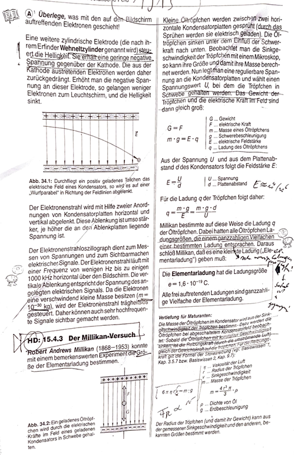

**Kurzes Rätsel (Die wichtigsten Arten der Stromleitung Basiswissen 6, Seite 89)**  

1. Stromleitung: Metall  

Sobald Metall fest wird, verliert das Atom schon ein paar Elektronen, sodass sie frei herumschwirren. Diese Elektronen werden Leitungselektronen oder Elektronengas genannt. Die durch den Elektronenmangel positiv geladenen Atome ordnen sich relativ gleichmäßig an. Das Ganze hält zusammen wegen der Anziehung der Ionen und des Elektronengases. Stromkreis: Elektronen fließen vom Minus- zum Pluspol. Dabei stößt vereinfacht gesagt das Elektron vom Minuspol das „erste“ Elektron vom Leiter$-→$ Elektronen stoßen einander ab. Strom= Menge bewegter Leitungselektronen. Diese Leitungselektronen sind aber schon im Leiten.  

Millikan untersucht, wie oft man die elektrische Ladungsmenge teilen kann. Unendlich oft oder gibt es eine kleinste Ladungsmenge?  

**Experiment**: Die Öltröpfchen sind durch das Sprühen negativ geladen und fallen durch das Loch nach unten. Achtung: Im Vakuum funktioniert das Experiment nicht!  

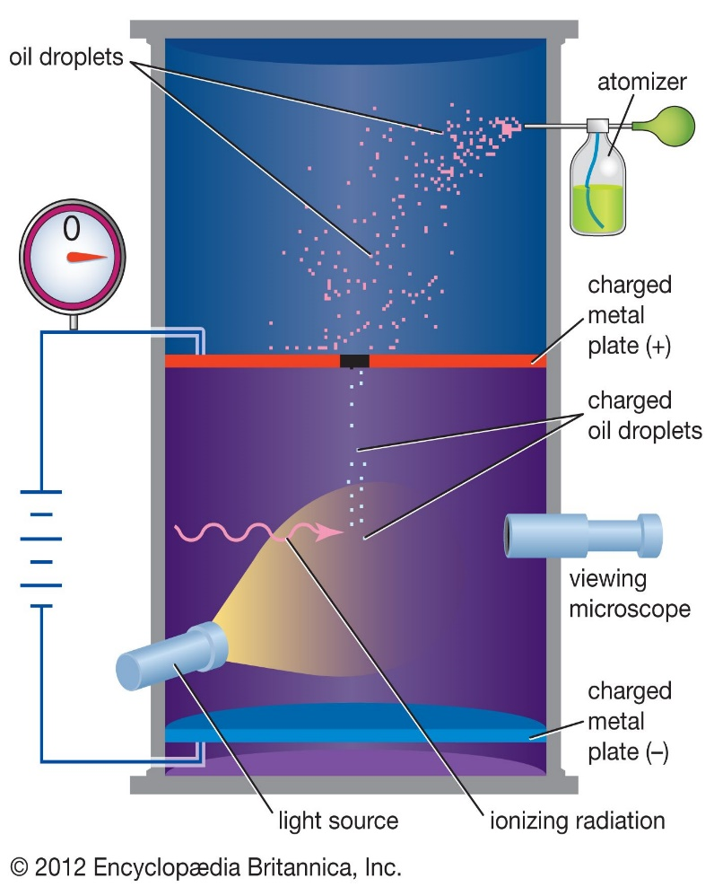

1) Schwebephase: in der Schwebephase wird ein Tröpfchen beobachtet, dass durch die Öffnung geflogen ist und dann schwebt. Das ist möglich, da er die elektrische Feldstärke des elektrischen Feldes verändern kann. Durch dieses wird der negativ geladene Tropfen von der positiv geladenen Metallplatte angezogen und von der Gravitation angezogen. Er schwebt, da ein Kräftegleichgewicht herrscht.  

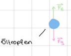

- $F_{G}=m\cdot g$
$$
F_{E}=Q\cdot E
$$

$Q= Ladung des Teilchens E=elektrische Feldstärke$ & für den Schwebzustand gilt:  

$$
F_{E}=F_{G}
$$

Die elektrische Feldstärke E ist direkt proportional zu der Spannung u: $Q\cdot E= m\cdot g$  

Aus der Schwebephase können wir für die Berechnung von der Ladung des Teilchens Q die Erdbeschleunigung g und die elektrische Feldstärke E feststellen, aber noch nicht die Masse m.  

2) Sinkphase  

In der Sinkphase schaltet Millikan die Spannung auf 0, d.h. es wirkt kein elektrisches Feld, d.h. auch keine elektrische Kraft mehr anfänglich wirkt auf den Tropfen nur mehr die Gewichtskraft und er beginnt zu fallen. Dadurch nimmt die Geschwindigkeit des Tropfens zu und der Luftwiderstand beginnt zu wirken (Stokes-Reibungskraft, FRS). Da die Stokes Reibungskraft proportional zur Geschwindigkeit des Tropfens ist, herrscht sehr bald ein neues Kräftegleichgewicht zwischen der Gewichtskraft und der Stokes Reibungskraft: Sobald sich das Kräftegleichgewicht einstellt, fällt der Tropfen mit konstanter Geschwindigkeit nach unten und Millikan misst diese Sinkgeschwindigkeit.  

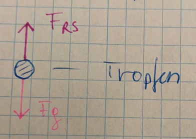

$$
F_{RS}=F_{g}
$$

$$
6π ηrv=m\cdot g
$$

$m=Masse des Tropfens$  

$g=Erdbeschleunigung=9,81 m/s$  

**$η=Viskosität$**  

$r=Radius des Tropfens$  

**$v=Sinkgeschwindigkeit$**  

Alles Variablen außer die Masse m und der Radius r sind bekannt.  

$$
ρ=\frac{m}{V}
$$

$$
V=\frac{4πr^{3}}{3}
$$

$$
m=\frac{4πr^{3}ρ}{3}
$$

$V=Volumen der Kugel ,$ $ρ=Dichte des Öltropfens$  

$m\cdot g=6π ηrv$=$\frac{4r^{3}ρπ  g}{3}$  

$$
m=\frac{4r^{3}ρπ  g}{3}
$$

$$
r=\sqrt{\frac{18 ηv}{4gρ}}
$$

$$
Q=\frac{m\cdot g}{E}
$$

Über die Formel der Stoffdichte berechnet Millikan den Radius eines bestimmten Tropfens und kann damit die Masse dieses Tropfens berechnen. Dieses Ergebnis setzt er jetzt in die Formel für die Ladung dieses bestimmten Tropfens ein, die er in der ersten Phase, also in der Schwebephase gewonnen hat. $Q=\frac{m\cdot g}{E}$  Damit hat er zum ersten Mal die Ladung eines bestimmten Tropfens, und diese Formel muss er jetzt bei allen Tropfen wiederholen.  

3) Analysephase  

Milikan misst alle Ladungen und trägt sie in das Diagramm ein. Man sieht, dass es keine beliebigen Ladungen gibt, sondern eine Ladung, deren ganzzahligen Vielfache die einzigen möglichen Ladungen sind.  

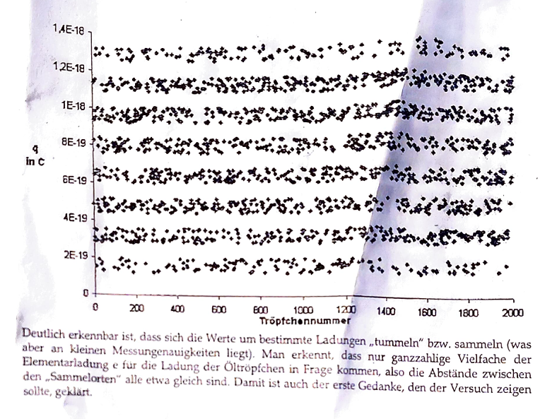

## 5.1.5 Gewitter, Blitz und Donner

Ein Sommergewitter entsteht, wenn feuchte Luft durch die Sonne erhitzt wird. Diese steigt auf und das Wasser kondensiert. Es entstehen Wolken. Die Sonneneinstrahlung ist auch verantwortlich für die Ladung der Wolke.  

Wenn die Spannung zwischen Wolke und Boden hoch genug ist, kommt es zum Blitz. Es ist das gleiche Prinzip, wie die Influenzmaschine. Allerdings nimmt man an, dass es einen Auslöser für den Blitz braucht, da die Spannung alleine für den Überschlag nicht ausreicht. Übrigens: Der Donner ist das gleiche Geräusch, wie das Knacken des Blitztes bei der Influenzmaschine. Der Trigger ist höchstwahrscheinlich kosmische Strahlung  

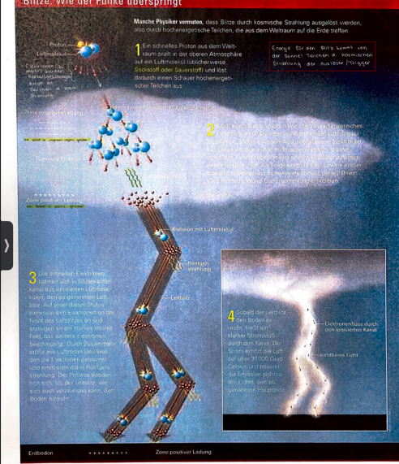

**Exkurs: Elektromagnetische Wellen**  

Maxwell hat 1860 erkannt, dass beschleunigte, elektrisch geladene Teilchen (zB. Elektronen) elektromagnetische Wellen emittieren. Je stärker die Beschleunigung, umso höher die Energie der elektromagnetischen Wellen. Die Abbremsung (negative Beschleunigung), sowie das Herausschlagen (positive Beschleunigung) der Elektronen erreicht offensichtlich derart hohe Werte, dass während des Blitz-Entstehungsprozesses sogar Röntgen- und Gammastrahlung emittiert werden.  

3) Leitblitz/ Ionenkanal/ Plasmakanal/ Ionenbrücke: Ist unsichtbar und auf keinen Fall mit dem echten Blitz zu verwechseln. Dieser besteht aus ionisierten Luftmolekülen. Durch den Leitblitz wird der Blitz geleitet. Man kann ihn mit einem Stromkabel vergleichen.  

4) Der Hauptblitz fließt jetzt durch die Ionenbrücke. Dieser Blitz ist der, den man alltäglich kennt; er ist sichtbar.  

**Erklärung des Donners**  

Aufgrund der hohen Temperatur dehnt sich die Luft zylinderförmig um den Blitz explosionsartig aus, weshalb wir den Donner als sehr laut wahrnehmen.  

==Punktförmige Quelle==  

$I_{s} ist proportional zu \frac{1}{r^{2}}$  

**$I_{s}=Schallintensität/Schallstärke$**  

$r=Abstand zwischen Schallquelle und Mensch.$  

**Linienförmige Quelle**  

$I_{s} ist proportional zu\frac{1}{r}$  

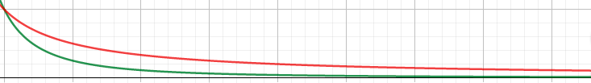

**Rot=Linienförmig**  

**Grün=Punktförmig**  

**Blitzableiter**  

Soll am höchstem Punkt des Daches sein, um den Blitz „anzuziehen“. Allerdings ist das kein 100-prozentiger Schutz, da er nur bevorzugt oben einschlägt. Außerdem gibt es das Absprungverhalten, wobei sich der Blitz auffächert.  

## 5.1.6 Das elektrische Kraftgesetz/Coulomb-Gesetz

**Mit dem elektrischen Kraftgesetz kann man die elektrische Kraft (Anziehung bzw. Abstoßung) zwischen Punkt- bzw. Kugelförmigen Körpern berechnen.**

$f_{E}=F_{C}=\frac{1}{4π\in_{0}}$ *$\frac{Q_{1}Q_{2}}{r^{2}}$ =$\frac{Q_{1}Q_{2}}{4πr^{2}\in_{0}}$  

$f_{E}=F_{C}=Elektrische Kraft$  

$Q_{1}Q_{2}=2 Ladungsmengen der zwei Körper$  

$r=Abstand zwischen den Laungsmittelpunkten von Q_{1} und Q_{2}$  

$\in_{0}=8,85*10^{-12}\frac{As}{Vm}=elektrische Feldkonstante$  

Mit welcher Kraft ziehen einander das Elektron und das Proton im Wasserstoffatom an? Radius von H-Atom: 10-10 m.  

1.6*10-19C=Q1  

Q2=-1.6*1019 C  

$\frac{1.6*10^{-19}*-1.6*10^{-19}}{4π8.85*10^{-12}}$= $2.3\cdot 10^{-8}$  

## 5.1.7 Theorie des elektrischen Stromes und Messungen

**Handhabung von Multimetern**  

**Gleichstrom**: DC  

**Wechselstrom**: AC  

Aus Sicherheitsgründen sollte man eher mit größeren Werten arbeiten.  

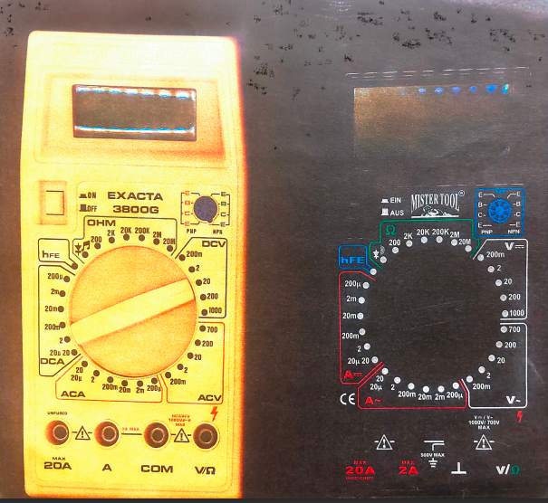

**Messaufgabe**: Bereite das Multimeter für die Messung der Spannung einer Solarzelle vor.  

==1) Die Stromstärke==  

**Symbol**: I  

**Einheit**: Ampere, A  

**Messgerät**: Amperemeter  

Definition der Stromstärke:  

Die elektrische Stromstärke gibt an, welche Ladungsmenge in einer bestimmten Zeitspanne durch den Querschnitt eines elektrischen Leiters fließen.  

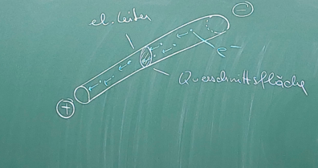

$$
I=\frac{Q}{t}
$$

$Q=Ladungsmenge  t=Zeit$  

Definition Ampere:  

$$
1A=\frac{1C}{1s}
$$

**Rechenbeispiel:**  

Wir messen die Stromstärke, die eine Solarzelle liefert und berechnen die Anzahl der Elektronen, die pro Sekunde von der Solarzelle in Bewegung gesetzt werden. Wir messen eine Stromstärke von 0.44 mA  

$$
Q=t\cdot I    Q=0.00044\cdot 1C
$$

$$
Q=N\cdot e
$$

$$
N=\frac{Q}{e}
$$

$$
N=\frac{0.00044}{1.6\cdot 10^{-19}}
$$

$$
N=2.75\cdot 10^{15}
$$

Wir unterscheiden aus historischen Gründen zwei Stromrichtungen:  

- Technische Stromrichtung (Plus zu Minus): wird in der Technik nach wie vor verwendet, ist aber falsch!
- Physikalische Stromrichtung (Minus zu Plus): Entspricht der Bewegung der Elektronen, ist physikalisch richtig.
==2) Die elektrische Spannung==  

**Symbol**: U  

**Einheit**: Volt/V  

**Messgerät**: Voltmeter  

Das Voltmeter wird parallel zum Verbraucher bzw. Widerstand geschalten.  

Gedankenexperiment zur Relativität der elektrischen Spannung  

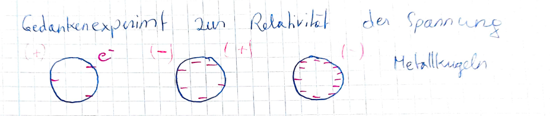

Spannungen sind relativ zu verstehen, das führt zu folgendem Zustand, dass manchmal ein Körper relativ zu einem weiterem Körper negativ und zu einem dritten positiv geladen ist.  

**Rätsel:**  

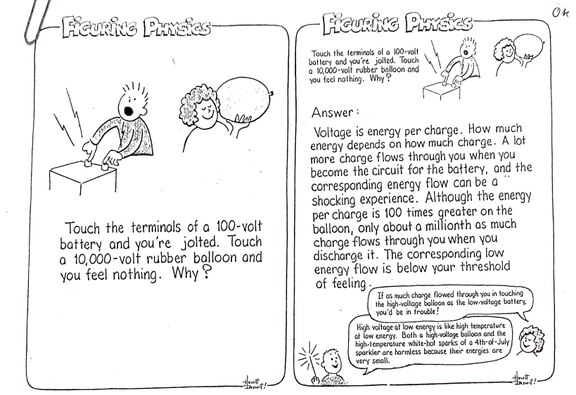

$$
Q=10^{-3}C
$$

|  |  |
| --- | --- |

==3) Die elektrische Leistung==  

**Symbol**: P  

**Einheit**: Watt, W  

**Definition**: Die Elektronen, die sich bei Stromfluss durch einen metallischen Leiter bewegen wechselwirken dabei ständig mit den positiven Metallionen. Sie geben dabei Energie ab, was zu einer Erwärmung bzw. Erhitzung des Metalls führt (Joule’sche Wärme). Da die Leistung gleich Energie pro Zeit ist, wird der Leistungswert eines Elektrogerätes üblicherweise gut leserlich auf dem Gerät angegeben. Die Joule’sche Wärme wird bei folgenden Geräten verwendet: Föhn, Herdplatte etc.  

==Ableitung für die Formel der elektrischen Leistung==  

**Ansatz/Start:**  

$U=\frac{E}{Q}$ 		 $E=U\cdot Q$	$P=\frac{U\cdot Q}{t}$  

$I=\frac{Q}{t}$		$P=U\cdot I$  

**Erklärung**: Die Leistung ist wie vorher beschrieben Energie durch Zeit. Energie lässt sich mithilfe der Formel der Spannung ausdrücken. Das sind die ersten drei Formeln. Man erkennt, dass ein Teil der Formel für die Leistung die Formel zur Berechnung der Stromstärke ist. Man ersetzt diesen Teil durch I.  

==4) Der elektrische Widerstand:==  

**Symbol**: R  

**Einheit**: Ohm/Omega  

**Multimeterfunktion**: Ohmmeter  

Das Ohmmeter wird direkt mit dem zu messendem Gerät verbunden ohne äußerer Spannungsquelle. De Begriff des elektrischen Widerstandes hat zwei Bedeutungen:  

- Physikalische Bedeutung: Der Widerstand ist ein Maß für den Energieverlust und damit ein Maß für den Spannungsabfall der Elektronen, die sich als Strom durch den Leiter bewegen. Sie verlieren deshalb Energie, weil sie andauernd mit den Metallionen des Metallgitters wechselwirken und dabei ständig abgebremst werden.
Aus der Formel $U=\frac{E}{Q}$ folgt: Dieser Energieverlust führt zu einem Spannungsabfall (z.B. bei einem Widerstand oder in einem Kabel).  

- In diesem Sinne ist der Widerstand ein elektrisches Bauelement in allen elektronischen Geräten. Sein Zweck besteht darin, die Stromstärken und Spannungen in Elektrogeräten bzw. elektrischen Schaltungen zu steuern und zu begrenzen (damit zum Beispiel andere elektronische Bauelemente nicht durch zu hohe Spannungen beschädigt werden).
## 5.1.8 Das Ohm’sche Gesetz

**Das Ohm’sche Gesetz gibt den Zusammenhang zwischen Stromstärke, Spannung und Widerstand bei den meisten elektrischen Vorgängen (Ausnahme Supraleiter) an.**

Erarbeitung des Ohm’schen Gesetzes im Experiment:  

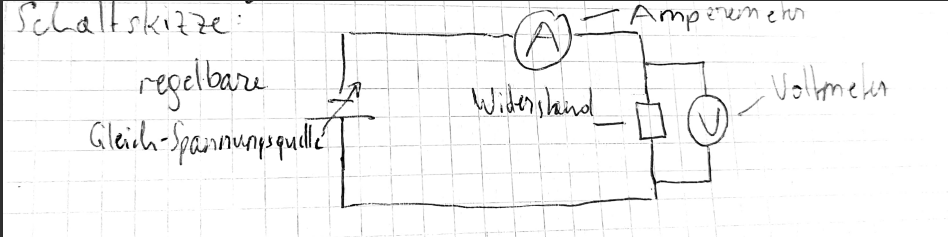

Wir regeln die Gleichspannung zwischen 0 und 15 Volt und stellen fünf verschiedene Spannungswerte ein und messen die entsprechende Stromstärken  

R=100 Ω  

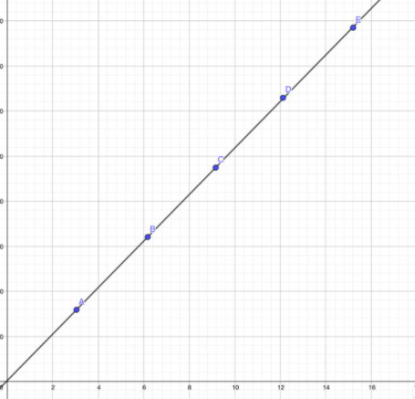

| Messung | U (V) | I (mA) |
| --- | --- | --- |
| 1 | 3,04 | 31.8 |
| 2 | 6.17 | 64,1 |
| 3 | 9,16 | 94,9 |
| 4 | 12,12 | 125,9 |
| 5 | 15,2 | 157 |

Interpretation des Ohm’schen Gesetzes:  

- Wenn U=konstant, $U=R\cdot I$  Wenn R steigt, sinkt I und umgekehrt. (Netzspannung im Alltag)
- Wenn r konstant, $R=\frac{U}{I}$ Wenn die Stromstärke steigt, sinkt die Spannung und umgekehrt. (unser Experiment)
- Wenn I konstant $I=\frac{U}{R}$ Wen die Spannung steigt, steigt der Widerstand und umgekehrt. (in der Forschung, Medizin)
Wir berechnen eine 100 Watt Glühbirne im Vergleich zu einem 1100 Watt Föhn. U=230  

**Gesucht**: ILampe IFöhn  RLampe RFöhn  

$$
I=\frac{P}{U}=\frac{230}{100}=0.435 A
$$

$$
R=\frac{U}{I}=\frac{230}{0.43}=534.88
$$

Das Haushaltsstromnetzwerk ist folgendermaßen aufgebaut: Je größer die Leistung eines bestimmten Elektrogerätes ist, umso größer muss auch die Stromstärke sein (da ja die Spannung mit 230 Volt gleichbleibt). Damit es jedoch eine größere Stromstärke geben kann, muss der Gesamtwiderstand des Elektrogeräts klein sein.  

## 5.1.9 Der spezifische Widerstand

Buch Seite 97  

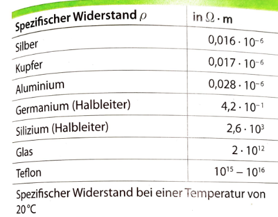

**Formel**: R=$ϱ\cdot \frac{l}{A}$  

R=Widerstand eines metallischen Leiters  

l=Länge des Leiters  

A= Querschnittsfläche des Leiters  

ϱ=Spezifischer Widerstand  

Der spezifische Widerstand ist eine Funktion, das heißt abhängig von der Temperatur und der Art des Metalls (Gold und Kupfer zum Beispiel sind gute Leiter, Eisen und Blei schlechte).  

Begründung für die Formel:  

**Ad 1**: Je höher die Temperatur, desto heftiger bewegen sich die Metallatome um ihrer Ruhelage. Daraus folgt mehr Wechselwirkung mit den Elektronen.  

**Ad 2**: Je länger der Leiter, desto mehr Metallatome gibt es, mit denen die Elektronen wechselwirken.  

**Ad 3**: Je dünner der Draht, umso weniger Platz haben die Elektronen, um durchzukommen.  

**Ad 4**: unterschiedliche Metalle bestehen aus unterschiedlichen Atomen mit unterschiedlicher Atomkonfiguration in den Orbitalen.  

**Rechenbeispiel:**  

In Baumärkten bekommt man Elektrokabel aus Kupfer zu kaufen. Die Länge beträgt 100 Meter und der Durchmesser 1 mm. Wie groß ist der Widerstand dieses Kabels?  

**Widerstand**: 2.165 Ohm.  

## 5.1.10 Experimentelle Bestätigung der Temperatur Abhängigkeit des Widerstands mittels einer direkten und indirekten Messung einer Glühbirne

Indirekte Messung:  

U= 2.57 V  

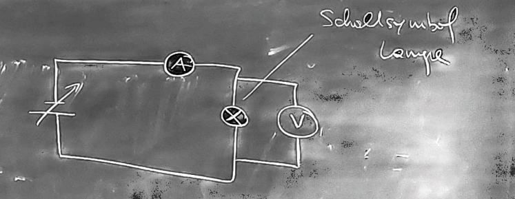

I= 0.3 A  

R= 8.57 Ω  

Direkte Messung:  

Lampe an Ohmmeter anschließen.  

R=1.3 Ω  

Der indirekte Widerstand ist um so viel höher da die Lampe warm wird und so auch der Widerstand steigt.  

Nach der Entdeckung der Supraleitung bei Metallen wurde eine andere Klasse von Supraleitern entdeckt, die sogenannten keramischen Supraleiter (das sind Metall-Sauerstoff Verbindungen). Keramische haben eine wesentlich höhere Sprungtemperatur von über -200 Grad Celsius, sodass sie auch mit flüssigem Stickstoff gekühlt werden können, was wesentlich einfacher und billiger ist. Anwendungen: Quantencomputer, Kernspintomographie, CERN und LHC, Weltraumforschung.  

## 5.1.11 Stromsicherheit

Siehe Basiswissen 6, Seite 105  

1 mA ist die Warnehmungsschwelle  

10 mA ist die Loslassschwelle  

80 mA Lebensgefahrschwelle  

