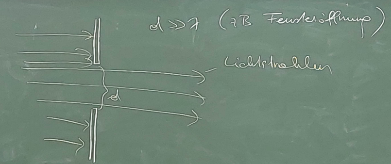
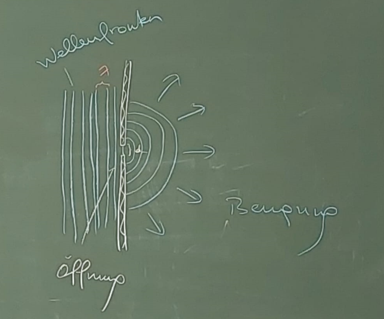
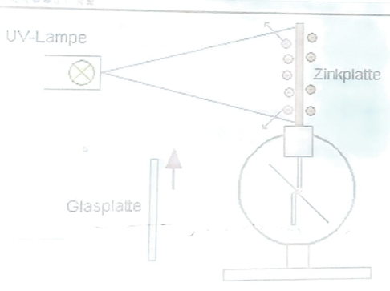

Diese Einteilung der Optik geschieht nach pragmatischen Gesichtspunkten, sie erfolgt hinsichtlich der Merkmale: Wellenlänge bzw. Frequenz, Größe bzw. Ausdehnung der beleuchteten Objekte und Öffnungen, Betrag der Lichtenergie, Empfindlichkeit der Messgeräte und Anzahl der Photonen.  

## 6.3.1 Geometrische Optik/Strahlenoptik:

Das Licht wird aufgefasst als Strahlenausbreitung/ geradlinige Ausbreitung des Lichtes, Alltagsdiskurs des Lichtes. Die geometrische Optik darf man verwenden, wenn gilt:  

d>>λ	λ=Wellenlänge 	d=Größe der beleuchteten Gegenstände und Öffnungen (unser Experiment mit dem breiten Spalt).  Die Zahl der Photonen ist groß. Die Lichtenergie ist eher gering.  

## 6.3.2 Wellenoptik

In der Wellenoptik wird das Licht bestehend aus Wellen gedacht. Diese Beschreibung des Lichtes darf verwendet werden, wenn folgende Merkmale gegeben sind:  

$d≈λ$ Das heißt die Breite der Öffnung bzw. die Breite des Hindernisses ist ungefähr so groß wie die Wellenlänge. Anzahl der Photonen ist groß, Lichtenergie ist eher gering.  

## 6.3.3 Quantenoptik

Die Quantenoptik muss verwendet werden, wenn folgende Situation vorliegt. Die Energie der Photonen ist relativ hoch, Zahl der Photonen ist relativ gering, die Empfindlichkeit der optischen Messgeräte ist recht hoch. In der Quantenoptik wird Licht verstanden als eine Menge von Photonen, wobei diese auf 1 zurückgehen kann, das heißt Teilchen im Sinn der Quantenphysik. Um die Lichtphänomene vollständig zu verstehen, brauchen wir die Quantenoptik.  

**Photoeffekt**: UV-Strahlung schlägt ab einer gewissen Mindestenergie Elektronen aus einer negativ geladenen Zinkplatte heraus. Dieser Effekt konnte mit der klassischen Elektrodynamik nicht erklärt werden:  

- Gemäß dieser Theorie ist die Energie einer elektromagnetischen Welle proportional zum Quadrat ihrer Amplitude ($E∝A^{2}$). Demgemäß hätte zum Beispiel sehr helles rotes Licht ebenfalls Elektronen herausschlagen sollen, was jedoch nicht geschehen und damit falsch ist.
- Bei UV-Strahlung sehr geringer Amplitude hätte es eine gewisse Zeit (Einschwingzeit) dauern müssen, bis sie rausgeschlagen werden, auch das ist nicht passiert. Sobald die UV-Strahlung die nötige Energie hat, treten sofort einige Elektronen aus.
Erklärung des Photoeffekts durch Einstein und die Quantentheorie:  

Die Energie eines Photons ist $E_{γ}=h\cdot f$. UV-Strahlung besteht aus Photonen sehr hoher Energie. Ab einer bestimmten Mindestenergie wird das Photon von einem Elektron absorbiert; das Elektron gewinnt dadurch Energie und kann so von der Zinkplatte abgelöst werden. Die Zahl der herausgeschlagenen Elektronen hängt direkt von der Zahl der Photonen ab: Je mehr Photonen, desto mehr Elektronen werden herausgeschlagen. Je höher die Energie der Photonen ist, umso mehr Energie haben die freigesetzten Elektronen und umso größer ist ihre Geschwindigkeit v. Die Energie der einzelnen Photonen ist entscheidend, nicht die Gesamtenergie aller Photonen. Genauere Erklärung durch Einstein: $E_{γ}=f\cdot h$.  

**Energiebilanz**: $E_{γ}=E_{Kin}+E_{A}$		$E_{Kin}=Kinetische Energie$  

$E_{A}=Ablösearbeit$= Die Energie, die nötig ist, damit man ein Elektron aus dem Metallverband (Zinkplatte)  ablösen bzw.  

$E_{γ}=Energie des Photons.$  

$E_{γ}=\frac{m_{e}\cdot v^{2}}{2}+E_{A}$		$m_{e}=Masse des Elektrons$	$v=Geschw. vom Elektron$  

Wir unterscheiden drei Fälle:  

- $E_{γ}<E_{A}…Es werden keine Elektronen herausgeschlagen$
- $E_{γ}=E_{A}…Elektron wird herausgeschlagen, hat aber keine GEschwindigkeit$
- $E_{γ}>E_{A}…Elektron wird herausgeschlagen und v is umso größer, je höher E_{γ} ist.$

