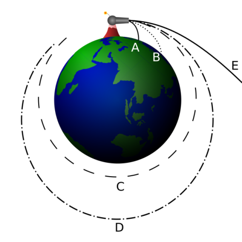
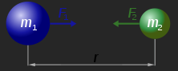
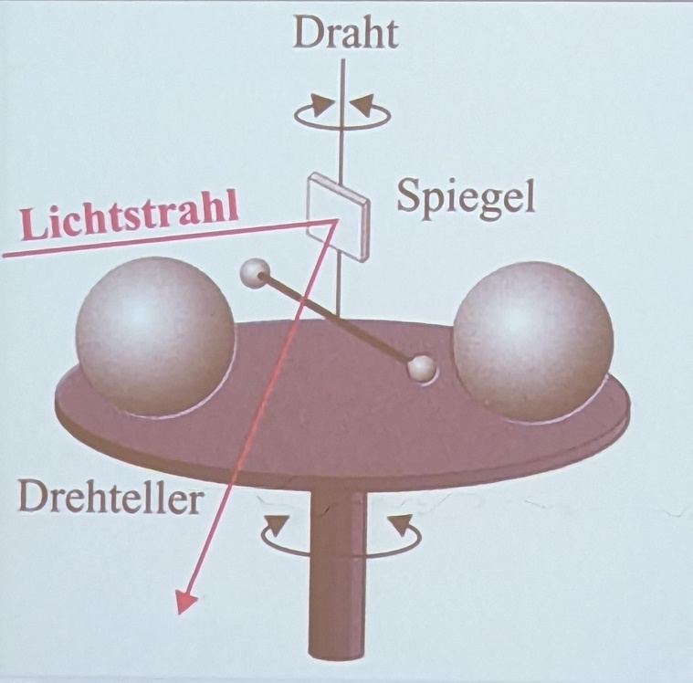
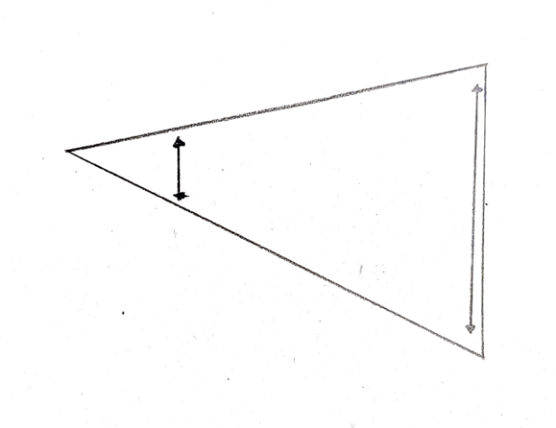
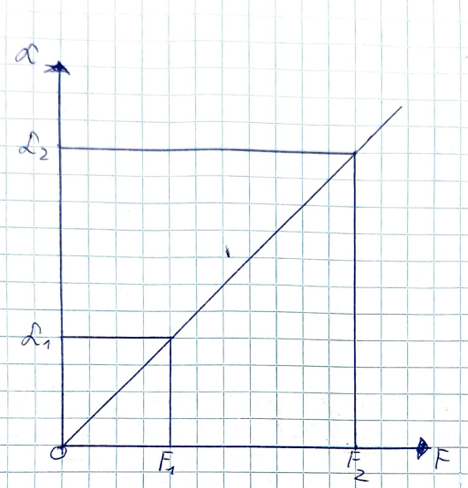

## 7.3.1 Gedankenexperiment von Newton

Newton sucht nach einem Weg, um die Bewegung von Himmelskörpern und der Bewegungen von Körpern auf der Erde zu vereinheitlichen. Man ging davon aus, dass die Bewegung von Himmelskörpern anderen Gesetzen unterliegen, als Objekte auf der Erde. Newton schafft diesen Sonderstatus des Himmels ab. Wenn jemand auf einem Berg einen Stein wirft, wird er in einer Parabel zu Boden fallen, wenn er ihn stark genug wirft, wird er in eine Umlaufbahn gelangen. Damit erklärt er die Gravitation als Ursache für Umlaufbahnen. Das wäre die erste Vereinheitlichung.  

## 7.3.2 Das Newton’sche Gavitationsgesetz

Das Gravitationsgesetz dient zur Berechnung der Gravitationskraft zwischen beliebigen Massen (meistens Himmelskörper) in einem bestimmten Abstand zueinander.  

$$
F_{G}=G\cdot \frac{m_{1}\cdot m_{2}}{r^{2}}
$$

FG Steht für die Gravitationskraft, G für die Gravitationskonstante $(6.67\cdot 10^{-11}\frac{N\cdot m^{2}}{kg^{2}})$, m1 und m2 für die jeweiligen Massen und r für den Abstand zwischen den Massenmittelpunkten (nicht der Oberflächen). Aus der Formel lässt sich ableiten, dass die Gravitationskraft direkt proportional zu den Massen und indirekt proportional zu r2 ist. Die Konstante ist notwendig, da die Gravitation sonst zu strak wäre. Woher es wirklich kommt weiß man nicht.  

**Rechenbeispiel:**  

Berechne die Gravitationskraft zwischen der Erde und einem Menschen mit der Masse von 72kg, der auf der Oberfläche steht.  

$$
6,67\cdot 10^{-11}\cdot \frac{5,974\cdot 10^{24}}{6370000^{2}} N
$$

## 7.3.3 Die Gravitationsfeldstärke g

Die Gravitationsfeldstärke gibt in jedem Punkt im Raum um einen Himmelskörper (d.h. im Gravitationsfeld des Himmelskörpers) die entsprechende Stärke des Gravitationsfeldes an. Dieser Punkt befindet sich im Abstand r zum Massenmittelpunkt des Himmelskörpers. Da die Gravitationsfeldstärke ein Vektor ist, bildet die Gesamtheit aller Gravitationsfeldstärkevektoren das Gravitationsfeld dieses Himmelskörpers.  

Herleitung der Formel für die Gravitationsfeldstärke:  

$$
F_{g}=F_{G}
$$

**$F_{g}=Gewichtskraft$**  

**$F_{G}=Gravitationsgesetz$**  

$$
m\cdot g=G\cdot \frac{m_{1}\cdot m_{2}}{r^{2}}
$$

$$
g=\frac{G\cdot m_{1}}{r^{2}}
$$

$$
g=\frac{G\cdot M}{r^{2}}
$$

**Üblicherweise gilt**: M ist die Masse eines Himmelskörpers, in diesem Fall ist die Gravitationsfeldstärke g gleich der Schwerebeschleunigung im Gravitationsfeld des Himmelskörpers (meistens an der Oberfläche).  

**Rechenbeispiel**: Berechne die schwere Beschleunigung auf dem Mond und vergleiche sie mit der Erdbeschleunigung.  

$g_{Mond}=\frac{6,67\cdot 10^{-11}\cdot 7,3483\cdot 10²²}{1 737 400^{2}}=1,6426$  

**$g_{Erde}=9,81$**  

**$\frac{g_{Mond}}{g_{Erde}}=\frac{1}{6}$**  

$Auf dem Mond nur \frac{1}{6}  des Gewichts!$  

## 7.3.4 Das Experiment von Cavendish (1798)-Basiswissen 5, Seite 58.

Newton stellte seine Formel anhand der Bewegung des Mondes auf. Jedoch fand er nie den Wert von der Gravitationskonstante G. Um die Masse der Erde zu bestimmen, steigt jemand mit einem Pendel auf einen Berg und misst, dass das Pendel nicht senkrecht nach unten zeigt, sondern sich schwach in Richtung des Berges neigt. Mit diesem ungefährem Wert wurde die Gravitationskonstante näherungsweise bestimmt, da alle anderen Parameter der Formel $m\cdot g=\frac{G\cdot m_{1}\cdot m_{2}}{r^{2}}$ somit bekannt waren.  

Die jeweils kleinen und großen Kugeln ziehen sich an, wodurch sich der Draht mit den kleinen Kugeln eindreht. Der Spiegel ist notwendig, um die Bewegung darzustellen. Wenn ein Lichtstrahl auf ihn trifft und auf eine Wand reflektiert wird, sieht man mit größerem Abstand die Bewegung des Lichtes (das ja mit dem Draht verbunden ist) viel eindeutiger. Ohne den Spiegel würde man die Drehbewegung gar nicht sehen, da die Strecke, die die Kugeln zurücklegen extrem gering ist. Anhand des gleichschenkligen Dreiecks lässt sich mit zunehmendem Abstand die Schwankung des Lichtes gut darstellen.  

Der Drehteller ist für die Genauigkeit der Messung wichtig, da der Verdrillungswinkel so verdoppelt werden kann. Es werden zwei Messungen durchgeführt.  

Es stellt sich die Frage, warum die Kugeln sich nicht so weit annähern, dass sie sich berühren. Das liegt daran, dass die Hook’sche Kraft dafür sorgt, dass der Draht sich der Eindrehung widersetzt. Die Rücktreibend Kraft $F_{H}$ ist proportional zum Verdrillungswinkel. An dem Punkt des Stillstandes ist die Hook’sche Kraft gleich der Gravitation. Dadurch lässt sich die Gravitationskraft, die zwischen den Kugeln wirkt, ableiten. $F_{H}=F_{G}$. Zu diesem Zeitpunkt ist $F_{H}$ noch nicht bekannt, weswegen noch nicht G bestimmt werden kann. Um sie zu bestimmen, macht Cavendish eine Parallelmessung. Er verdrillt außerhalb des Apparates den Draht um gewisse Winkel und misst die benötigte Kraft mit einer Federwaage. Er beobachtet welcher Winkel wieviel Kraft benötigt. Dafür verwendet er viel größere Winkel als den Gemessenen und stellt somit eine Funktion auf. Er kann das machen, da es sich bei der Hook’schen Kraft um eine lineare Funktion handelt. Jetzt hat er  $F_{H} und somit auch F_{G}$ und damit alle Variablen, um G zu berechnen. $G=\frac{F_{G}\cdot r^{2}}{m_{1}\cdot m_{2}}$  

