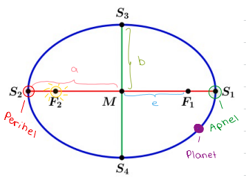
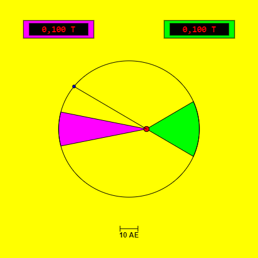
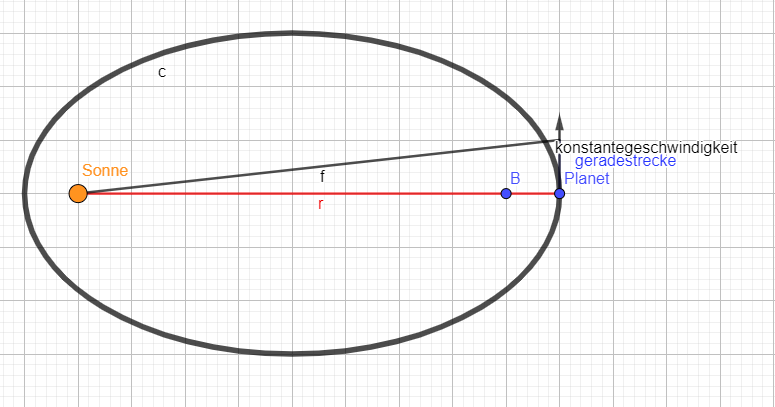
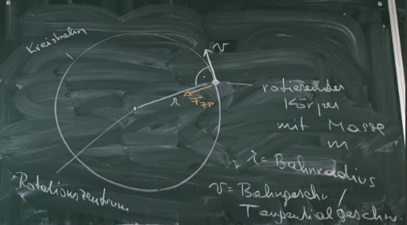

Kepler hat die drei Gesetze durch genaueste Beobachtung von Planetenbewegungen erkannt, ohne jedoch eine ausreichende Erklärung dafür zu haben. Erst im Rahmen der Newton’schen Gravitationstheorie konnten sie erklärt werden.  

## 7.4.1 Erstes Kepler’sches Gesetz

**„Die Planeten bewegen sich auf Ellipsenbahnen in deren gemeinsamen Brennpunkt die Sonne steht.“ (Basiswissen 5, Seite 60)**

Michel Foucault spricht von positivem Unbewussten. Ein Beispiel dafür ist das geozentrische Weltbild: Alle Sterne sind Kugeln und Die Bahnen sind rund. Kreisrunde Bahnen waren so selbstverständlich, dass es den Menschen gar nicht mehr bewusst war, dass es nur diese eine Meinung gab. Es beschriebt einen Zustand, in dem nur nachgesagt wird und nicht hinterfragt wird. Kepler bricht mit einer Jahrtausende Jahre alten Vorstellung, indem er postuliert, dass Planetenbahnen elliptisch sind.  

F1 und F2 = Brennpunkte  

e =  Exzentrität: gibt die Abweichung der Ellipse von der Kreisform an  

Perihel = Sonnennächster Punkt  

Aphel = Sonnenfernste Punkt  

a = Große Halbachse  

b = Kleine Halbachse  

## 7.4.2 Zweites Kepler’sches Gesetz

**„Der von der Sonne zum Planeten zeigende Radiusvektor r überstreicht in gleichen Zeiten gleiche Flächen.“**

$$
\frac{ΔA_{1}}{Δt_{1}}=\frac{ΔA_{2}}{Δt_{2}}
$$

$ΔA_{1},ΔA_{2}=überstrichene Fläche$  

**$Δt_{1},Δt_{2}=Zeitspanne$**  

$Wenn Δt_{1}=Δt_{2}$  

$Dann ΔA_{1}=ΔA_{2}$  

Das liegt an dem Drehimpuls. Je kleiner der Radius ist, desto schneller ist das Objekt.  

Grundlegende Formeln im Rahmen der klassischen Mechanik nach Newton:  

**Drehimpuls**: $L=m\cdot v\cdot r$  

L = Drehimpuls	m = Masse	r = Radius  

Der Drehimpuls eines Planeten ist in der Regel immer konstant.  

**Vereinfachung**: Wir betrachten die Bewegung des Planeten nur eine sehr kurze Zeitspanne. Dabei können wir so tun, als ob die Geschwindigkeit des Planeten konstant bleibt und als ob er während dieser kurzen Zeit eine gerade Strecke zurücklegt.  

**Ableitung:**  

$$
L=m\cdot v\cdot r=konstant
$$

$wenn v=konstant→Formel:v=\frac{s}{t}$  

$$
L=m\cdot \frac{s}{t}\cdot r=konstant
$$

$Fläche vom rechtwinkligen Dreieck:A=\frac{a\cdot b}{2}→\frac{r\cdot s}{2}$  

$$
s\cdot r=2A
$$

$$
L=m\cdot \frac{2A}{t}=konstant
$$

$$
\frac{A}{t}=\frac{L}{2m}=konstant
$$

$$
\frac{A_{1}}{t_{1}}=\frac{A_{2}}{t_{2}}=\frac{L}{2m}=konstant
$$

## 7.4.3 Drittes Kepler’sches Gesetz

**„Die Quadrate der Umlaufzeiten $T_{1} und T_{2}$ zweier Planeten verhalten sich wie die dritten Potenzen der großen Halbachsen $a_{1} und a_{2}$ ihrer Bahnellipsen.“**

**Formel:**  

$\frac{T_{1}^{2}}{a_{1}^{3}}=\frac{T_{2}^{2}}{a_{2}^{3}}=\frac{T_{3}^{2}}{a_{3}^{3}}=…=\frac{T_{8}}{a_{8}^{3}}→Immer in Sekunden umrechnen!$  

Herleitung des dritten Keplerschen Gesetztes im Rahmend der klassischen Mechanik Newtons:  

**Rotation:**  

Da jede Rotation eine beschleunigte Bewegung darstellt (weil sich zumindest andauernd die Richtung der Geschwindigkeit verändert) $→$ da für jede beschleunigte Bewegung Kraft notwendig ist, kann es eine Rotation nur geben, wenn sie durch eine Kraft verursacht wird: Diese Kraft wird als Zentripetalkraft bezeichnet und stellt einen abstrakten Kraftbegriff dar, konkret handelt es sich oft dabei um die Gravitationskraft oder um eine elektrische Kraftwirkung (es ist jedoch auch jegliche andere Kraft möglich, wie zb. die Kohäsion).  

$F_{ZP}=Zentripetalkraft=die Kraft, die eine Rotation verursacht$  

$$
F_{ZP}=\frac{m\cdot v^{2}}{r}
$$

$m=Masse des rotierenden Körpers \left(z.B. Planeten\right)$  

**$v=Geschwindigkeit$**  

**$r=Bahnradius$**  

$v=Bahngeschwindigkeit bzw. Tangentialgeschw.$  

$ω=Winkelgeschw.:gibt an welcher Winkel pro Sekunde zurückgelegt wird$  

$$
v=ω\cdot r
$$

$$
F_{ZP}=\frac{m\cdot v^{2}}{r}
$$

$$
v^{2}=ω^{2}\cdot r^{2}
$$

$$
F_{ZP}=\frac{m\cdot ω^{2}\cdot r^{2}}{r}
$$

$$
F_{ZP}=m\cdot ω^{2}\cdot r
$$

**Vereinfachende Annahme**: Wir gehen von einer Kreisbahn aus, ersetzen die große Halbachse $a$ durch den Radius $r$ und verallgemeinern das Ergebnis letztendlich auf Ellipsenbahnen.  

==Ansatz:==  

$$
F_{ZP}=F_{G}
$$

$$
\frac{m\cdot v^{2}}{r}=G\cdot \frac{m_{1}\cdot m_{2}}{r^{2}}
$$

$$
\frac{m_{2}\cdot v^{2}}{r}=G\cdot \frac{m_{1}\cdot m_{2}}{r^{2}}
$$

$m_{1}=Masse des umkreisten Körpers \left(z.B. Sonne\right)$  

$m_{2}=Masse des umkreisenden Körpers \left(z.B. Planet\right)$  

$$
m_{1}=M
$$

$$
\frac{v^{2}}{r}=\frac{G\cdot M}{r^{2}}
$$

$$
v^{2}=\frac{G\cdot M}{r}
$$

$$
ω=\frac{2 π}{T}
$$

**$T=Umlaufzeit$**  

$$
v=ω\cdot r
$$

$$
v^{2}=\frac{G\cdot M}{r}
$$

$$
ω^{2}\cdot r^{2}=\frac{G\cdot M}{r}
$$

$$
v^{2}=\frac{G\cdot M}{r}
$$

$$
ω=\frac{2\cdot π}{T}
$$

$$
v=ω\cdot r
$$

$$
ω^{2}\cdot r^{2}=\frac{G\cdot M}{r}
$$

$$
\frac{4π^{2}}{T^{2}}\cdot r^{2}=\frac{G\cdot M}{r}
$$

$$
\frac{4π^{2}r^{3}}{T^{2}}=G\cdot  M
$$

$$
\frac{r^{3}}{T^{2}}=\frac{G\cdot M}{4\cdot π^{2}}
$$

$$
\frac{T^{2}}{r^{3}}=\frac{4π^{2}}{G\cdot M}=konstant
$$

Wir gehe von der Kreisbahn zu der Ellipsenbahn über, das heißt wir verallgemeinern und ersetzen das r durch a.  

$$
\frac{T^{2}}{a^{3}}=\frac{4π^{2}}{G\cdot M}
$$

Interpretation der Formel: M ist die Masse des umkreisten Körpers , a ist die große Halbachse des umkreisenden Körpers, T ist die Umlaufzeit des umkreisenden Körpers (In Sekunden!). Beispiele für Systeme:  

| M | Umkreisender Körper |
| --- | --- |
| Sonne Erde Erde | Planet Mond Satellit |

Für Planetensysteme anderer Sterne gilt die Formel ebenfalls, es kommt auch eine konstante Zahl heraus, die für alle Planeten des Systems gleich ist, der Wert der Konstanten ist aber von Sonnensystem zu Sonnensystem unterschiedlich, weil die Massen der Sterne (M) unterschiedlich sind. Für unser eigenes Sonnensystem gilt:  

$$
\frac{T_{1}^{2}}{a_{1}^{3}}=\frac{T_{2}^{2}}{a_{2}^{3}}…=\frac{4π^{2}}{G\cdot M}=konstant
$$

Das Verhältnis ist grundsätzlich von den Massen der Planeten bzw. der umkreisende Körper unabhängig, es hängt nur von der Sonnenmasse bzw. der Masse des umkreisten Körpers und von der Gravitationskonstante ab.  

