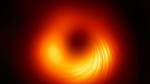
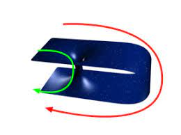

Der Begriff wird in der Sprache falsch verwendet. Es ist kein Loch, sondern dreidimensional, ein Geoid. Grundsätzlich ist es ein Gebilde, an dessen Oberfläche $v_{F}>c_{0} ist.$ Mit Oberfläche ist die tatsächliche Oberfläche der Masse gemeint. Am Ereignishorizont ist $v_{F}=c_{0}$. Alles, was sich innerhalb dieses Horizontes befindet (die im einfachsten Fall kugelförmig ist), kann der Gravitation des schwarzen Lochs nicht mehr entkommen.  

Es wird in der Regel zwischen zwei Arten unterschieden. Zum einen die gibt es die astrophysikalischen schwarzen Löcher, welche auch nachgewiesen sind. Theoretisch sollte es aber auch möglich sein, dass extrem kleine existieren. Deren Radius wäre kleiner als der eines Protons. Noch sind sie nicht nachweisbar. Sie sind schwer nachweisbar, da sie sehr schnell „verdampfen“. Das liegt an der Hawkin Strahlung, was ein quantenphysikalischer Effekt ist, der virtuelle Teilchen beinhaltet.  

Allgemeiner Aufbau eines nicht rotierenden schwarzen Lochs im Rahmen der Allgemeinen Relativitätstheorie: Die Allgemeine Relativitätstheorie ist der beste Zugang zu dem Thema, den wir haben, jedoch wirkt dieser unvollständig beziehungsweise widersprüchlich. Allerdings ist für eine Verbesserung des Konzeptes eine Theorie notwendig, die wir nicht kennen: Eine Quantentheorie der Gravitation. Das liegt daran, dass eine Singularität eine unendlich hohe Dichte haben müsste.  

Auch wenn man schwarze Löcher nicht sehen kann, kann man die elektromagnetische Strahlung der Akkretionsscheibe messen. Diese besteht zum Großteil aus elektrisch geladenen Teilchen, die von einem Stern in einem Doppelsystem bezogen werden.  

Ein besserer Beweis ist das erste „Bild“ eines Schwarzen Loches. Hier wird die elektromagnetische Strahlung farblich dargestellt. Außerdem sieht man natürlich nur den Ereignishorizont und nicht das echte schwarze Loch.  

Ein weiterer Effekt sind Gravitationslinsen bzw. Einstein Ringe. Das Licht, was von Objekten hinter dem Loch stammt, wird stark verzerrt.  

Herleitung der Formel für den Schwarzschildradius:  

$$
v_{F}=\sqrt{\frac{2\cdot G\cdot M}{r}}
$$

$$
v_{F}=c_{0}
$$

$$
3\cdot 10^{8}=\sqrt{\frac{2\cdot G\cdot M}{R}}
$$

**$R=Schwarzschildradius$**  

$$
c_{0}^{2}=\frac{2\cdot G\cdot M}{R}
$$

$$
R=\frac{2\cdot G\cdot M}{c_{0}^{2}}
$$

Diese Formel impliziert, dass der Radius sehr klein ist. Außerdem zeigt sie, dass jedes Objekt einen hat. Beispiel: Die Erde.  

$$
\frac{2\cdot 6.67\cdot 10^{-11}\cdot 5.977\cdot 10^{24}}{\left(3\cdot 10^{8}\right)^{2}}=0.008m
$$

**Wurmloch**: Ein theoretisches Objekt der Allgemeinen Relativitätstheorie. Mit diesem könnte man große Distanzen überwinden, jedoch ist nicht sicher, ob es tatsächlich existiert, da die Allgemeine Relativitätstheorie nicht zu 100% korrekt ist. Diese Abbildung ist stark vereinfacht, da sie von zweidimensionalen Raum ausgeht.  

